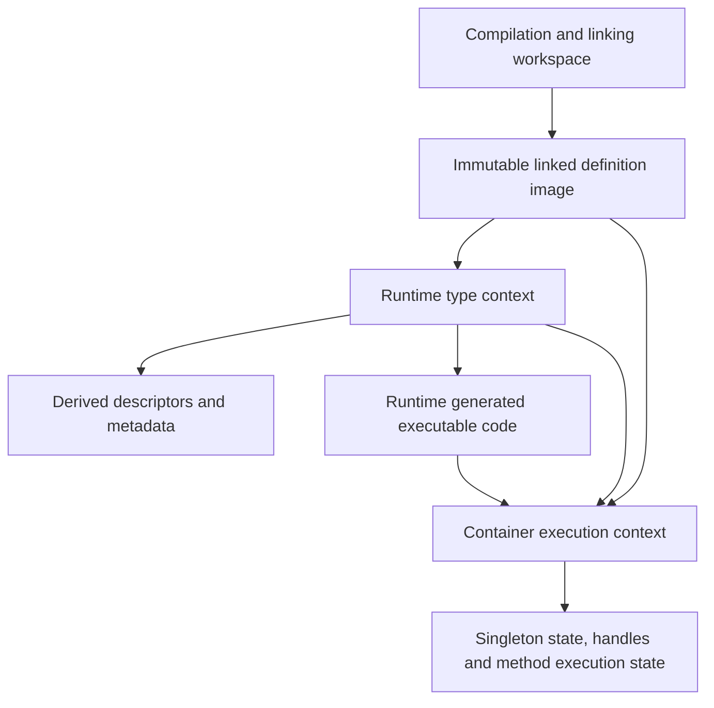

# Separating definitions, type metadata and execution state

Status: staged proposal and architectural prototypes, 2026-09-24. The experimental branch
`lagergren/constant-pool-state-separation` implements the singleton execution-state boundary and
the first descriptor/index boundary, including late-generated field initializers. Broad reflection
migration, metadata separation, other generated methods and whole-image freezing remain proposals.
The correctness baseline is `lagergren/constant-pool-ownership-only`, extracted from
master `601a68e8b` with prerequisite `d8c6c3176`, initial extraction `65e5ce149` and the subsequent
narrowing that removes the general listener migration.
[The ownership audit](constant-pool-ownership.md) documents its changes, regressions and remaining
limits. The original embedding/Gradle/shutdown work remains on
`lagergren/constant-pool-ownership`. JIT development remains separate.

## Recommendation and decision boundary

A separation is plausible and would make ownership easier to explain. Start by moving singleton
execution state out of definition constants, in a separate commit/PR after the correctness
baseline. Measure that limited prototype before committing to a fully frozen runtime image.
Do not combine the full architecture migration with this extraction.

The full split is substantial: factories, reflection, method execution, native bootstrap and
metadata queries currently use the same object graph. Moving a few cache fields does not freeze
that graph, and freezing it immediately would break legitimate runtime type construction.
The stages below are independently reviewable hypotheses, not a commitment to implement them.
The general error-listener architecture is a separate deferred project, preserved at
`archive/constant-pool-with-listener-migration` (`e90e5f8f8`) and on the original combined/errs
branches. It is not a prerequisite for these stages; this branch retains only the definition/cache
diagnostic ownership boundary using master's listener interface.

The existing ownership fixes remain necessary during migration. A destination must still be
explicit, and sharing a definition must still be distinguished from sharing a live value.
Freezing definitions removes some opportunities for accidental mutation; it does not decide
module compatibility, application isolation, diagnostic routing or synchronization for us.

## Why an immutable type system still has mutable pools

The [language design](x.md) says that a container's activated type system is immutable. That
constrains its declarations and relationships. It does not require every possible parameterized,
union, intersection or annotated type descriptor to have been materialized in advance.
Reflection can describe combinations of already-defined types without adding a declaration.

Today's implementation combines several distinct responsibilities:

| Responsibility | Current examples | Is it a disposable cache? |
|---|---|---|
| Compiled definitions and serialized constant indices | `FileStructure`, `Component`, `ConstantPool`, method code | No: these define the program and interpret its binary references |
| Canonical descriptors constructed on demand | `ensureParameterizedTypeConstant`, other pool factories | Not generally: canonical identity and indexing may be relied upon |
| Derived semantic metadata | `TypeInfo`, relation/variance/member maps on `TypeConstant` and related constants | Potentially, only if all inputs and diagnostic results are preserved |
| Native/runtime representations | templates, `ClassComposition`, reflective type handles | Context dependent; cannot assume portability between runtimes |
| Live execution state | singleton handles/waiters, method initialization, runtime annotation captures | No: clearing it can change observable behavior |
| Compiler working state | unresolved types, registers, validation recursion and diagnostics | Mutable, scoped to compilation; not runtime image data |

The ownership difficulties arise at several levels, rather than from caching alone. The audited
bugs include writing a source during adoption, choosing the wrong construction destination,
copying compiler state, retaining a request listener, and looking up a singleton in the wrong
container. Caches amplify these problems when they retain objects from another owner.

## Alternatives and their cost

| Option | Benefit | Limitation |
|---|---|---|
| Keep the corrected ownership model | Lowest migration cost; explicit destinations and isolated copies already fix demonstrated defects | Definitions, caches and execution state remain mixed; copies and reset logic remain necessary |
| Move execution state to side tables first | Gives singleton lifetime a clear home; permits testing shared definitions without shared values | Pools still create descriptors and metadata; this does not freeze them |
| Split linked images, descriptors, metadata and execution | Strongest structural boundary; may enable safe reuse and remove copies | Broad migration with native bootstrap, reflection and indexing consequences |
| Precompute every runtime type and freeze today's pool as-is | Superficially avoids a new descriptor layer | Not a general solution: runtime combinations and captured annotation values need on-demand representation |

The staged recommendation starts with the second option. Its results determine whether the
third option is worth pursuing. Keeping the corrected current model is a valid stopping point.

## Proposed boundaries

These are conceptual names, not a proposed final Java API.



### 1. Compilation and linking workspace

Keep mutable construction, unresolved constants, validation attempts, register allocation and
linking here. `FileStructure` and existing builders can initially keep their compiler APIs.
An explicit finalization step produces a complete linked image after validating references.
Compilation owns its request listener; no immutable image retains that listener. A future listener
API cleanup can tighten general null/branch contracts separately from this ownership boundary.

A compiler may discard or rebuild metadata as declarations change. That invalidation protocol
must remain distinct from memoization over a frozen runtime image. This design does not enable
parallel use of a mutable compiler or imply that its current structures are thread safe.

### 2. Immutable linked definition image

Own fixed declarations, method definitions, literal constants and the mapping from serialized
constant indices to definitions. References into another image carry an explicit image identity
and are resolved against a fixed dependency graph. Initially, identity can be an opaque token
per prepared image; do not invent a global content-addressed registry before it is needed.

Keep the XTC binary format unchanged in the first stages. Serialized indices remain local to
their image. Runtime-created descriptors must use a distinct reference domain, not silently
append to a serialized table or masquerade as a portable constant index. Audit `getPosition()`
consumers, frame constant arrays, relocation and switch dispatch before enforcing this boundary.

An image is publishable only after linking and structural native preparation have completed.
The image exposes read operations; attempts to register new definitions after publication fail
at the mutation boundary. A read that lazily decodes a body needs either a safely published,
immutable decoded value in a side table or eager decoding. It must not expose compiler-owned
mutable Ops or ASTs to several executions.

### 3. Runtime type context and derived metadata

Own an interner for immutable descriptors over a fixed image/dependency graph, plus separate
memo tables for derived facts. Runtime reflection asks this context to parameterize, combine or
annotate a type. A declaration can remain frozen while these descriptor tables grow.

Interning is not ordinary memoization: arbitrary eviction may break identity assumptions.
Its lifetime and growth need measurement and an explicit owner. A disposable relation cache
may be cleared only if recomputation has identical results, including diagnostic replay.
Neither table should retain a request listener, container service or captured object handle.

Query keys need every semantic input: image/generation identity, operands, type arguments and
any applicable access or resolution context. Native bindings belong in the key/context if they
affect the answer. Names alone are insufficient when a module is recompiled under the same name.
Start with context-local caches; sharing across contexts is a later optimization requiring proof.

Recursive calculations need calculation-local in-progress state and clear failure semantics.
Do not copy recursion guards or expose a partially calculated entry as a finished answer.
Immutable completed results can be published safely; synchronization and reentrancy still need
explicit design even when source definitions are immutable.

Diagnostics stored with metadata are immutable result values, replayed to the current request's
listener. Audit their payloads for retained AST/source/structure references before sharing them
across image lifetimes. Removing the listener reference alone does not establish bounded retention.

### 4. Container execution context

Own the live state associated with executing definitions: singleton values and initialization
coordination, reflective handles, native/template bindings, class compositions, and method
initialization state. Some representations may later prove shareable within a runtime; their
initial placement should reflect the narrowest proven lifetime.

The singleton lookup is conceptually:

1. Resolve the definition in the requesting container's type context.
2. Select the permitted value owner using explicit module-sharing ancestry.
3. Canonicalize the definition key in that owner's context.
4. Obtain or initialize the value in that owner's execution state.
5. Publish success or release failed initialization and notify waiters there.

Shared primitive/core values can belong to the native root. Unshared application singleton
state belongs to each application or nested container. Two containers reading the same image
do not automatically share a service, singleton constructor result or mutable handle.

Definition-sharing and value-sharing policies must be independent and visible in APIs. Type
compatibility does not grant authority to reuse a live object. Existing `getOriginContainer`
behavior is the starting contract, not an excuse to broaden sharing to every equal module name.

Execution-owned state is released with its existing owner. This plan does not implement socket,
watcher, timer or HTTP shutdown. Those mechanisms remain a separate part of the embedding series.
It must integrate with them later without forcing shutdown changes into this correctness branch.

## Source areas that constrain the design

| Area | Current behavior to preserve or separate | Likely first change |
|---|---|---|
| `ConstantPool`, `Constant.registerConstants`, `TypeConstant.registerConstants` | Adoption, canonicalization and definition ownership are combined | Separate read/resolve from destination construction; retain explicit destination adapters |
| `FileStructure` copy/merge/link, `MethodStructure.cloneBody` | Prepared structures are copied to isolate caches, code and execution state | Classify each copied field before eliminating copies |
| `SingletonConstant`, `ConstHeap`, `Container`, `Utils` | Constant objects hold handles/waiters; owner dispatch is necessary | Move initialization state to an owner-local table keyed by canonical definition |
| `TypeConstant`, `TypeInfo`, parameterized/signature/property constants | Semantic caches and recursion state live beside definitions | Move one proven-pure calculation at a time into the type context |
| `MethodStructure`, `Frame`, service-local operation caches | Method initialization and decoded code have different lifetimes | Separate execution flags from immutable method body data; retain service-local runtime caches |
| `ClassTemplate`, `NativeContainer` | `markNativeMethod` / `markNativeProperty` can synthesize structural overrides | Finish structural preparation before freeze, or design an explicit native binding overlay |
| `xRTType`, `xRTTypeTemplate` | Reflection constructs descriptors and handles on demand | Route descriptors through the type context, handles through the execution context |
| `HandleConstant`, annotated types | Runtime annotation arguments can capture actual handles | Keep captures in an execution-owned representation; never put them in a globally shareable type key |
| Native template static `INSTANCE` and cached types/handles | Some state is classloader-wide today | Audit cross-runtime assumptions before publishing reusable images; do not call this solved |
| `TypeInfo` diagnostics and its build-local recorder | Metadata must not capture request sinks | Preserve request replay; inventory payload retention before broad cache sharing |

A compatibility facade can temporarily keep familiar methods, but it must require the relevant
context at construction/runtime boundaries. For example, a definition owner accessor remains a
read operation; `typeContext.parameterize(definition, arguments)` expresses construction;
`executionContext.singleton(definition)` expresses live-value access. Do not replace the old
ambient thread-local pool with an ambient thread-local type context under a new name.

Cross-image operations also remain explicit. A library definition may be read from image A while
a specialized descriptor is needed in context B. Either B can reference A through its dependency
graph or the operation must reject/translate that reference. Equal names do not establish equal
generations. Values capturing a container require additional lifetime checks even when their
underlying type definitions are compatible.

## Reviewable implementation sequence

| Stage | Scope and deliverable | Deliberately excluded | Evidence needed to proceed |
|---|---|---|---|
| 0. Correctness baseline | This extraction and ownership audit | Architectural implementation, Gradle modes, new JIT work | Independent unit and XDK integration passes |
| 1. Mutation inventory | Classify writes after activation; optional counters for registrations, copies and cache misses | Freeze enforcement or broad cache rewrite | Reproducible report naming mutation sites and lifetimes |
| 2. Singleton prototype | Owner-local initialization table; migrate handles, waiting and failure release together; narrow adapter for existing callers | TypeInfo/interner rewrite, native resource shutdown | Existing singleton regressions plus same-image isolation/sharing tests |
| 3. Descriptor boundary | Runtime descriptor interner distinct from compiled constant indices; explicit resolution context | Global interning, binary format changes | Reflection, cross-image resolution and index-domain tests |
| 4. Metadata separation | Move selected derived metadata and diagnostics to context-owned memo tables; later separate remaining runtime handles/method flags | Assuming every TypeInfo is context-free | Cache-clear equivalence, recursion/failure and generation-isolation tests |
| 4a. Generated executable code | Finish image-level synthesis before publication; move late delegation bodies and per-composition initializers into a context-owned executable overlay | Arbitrary eager generation of all generic specializations; mutable generated Ops in shared images | Delegation, accessors, const helpers, reflection and debugger tests against an unchanged image |
| 5. Frozen image | Complete native preparation; prohibit definition writes; immutable body publication | New container models or cross-build reuse | Full interpreter regressions with freeze guards enabled |
| 6. Optional sharing | Reuse proven immutable images/metadata across requests with measured retention policy | Cross-generation name-based cache, arbitrary interner eviction | CPU/allocation/retained-memory comparison and ownership assertions |

Each row is a scope boundary, not necessarily a single small PR. Stages 3–5 may need further
splits after stage 1's inventory; do not assign reliable effort estimates without that evidence.
The singleton prototype is the smallest useful architectural experiment, but even it must migrate
all initialization/failure paths rather than just moving the handle field.

Stage 4a is required because a metadata lookup can synthesize executable methods. It must be
coordinated with stages 3 and 4; a semantic cache cannot be declared image-pure while its lookup
still inserts methods into the image. The detailed inventory below identifies those paths.

Stages 2 and 4 should keep definitions usable by existing code through narrow transitional APIs.
Every intermediate commit must compile both interpreter and the existing shared JIT sources.
New JIT runtime behavior and its validation belong on the `JIT` branch; coordinate shared API
changes there rather than importing the archived embedding JIT implementation here.

## Validation plan

The current tests establish a correctness baseline, not proof of the proposed design. Add the
following with their corresponding stages; use assertions and deterministic barriers, with
bounded waits only as hang guards:

- Run two applications against the same image: unshared services/singletons stay independent;
  explicitly shared ancestors and native primitives preserve their expected identity.
- Exercise sibling and grandchild containers, singleton switch lookup, failed initialization,
  retry and multiple waiters. Coordinate concurrent waiters explicitly, without sleeps.
- Query with no ambient pool and with an unrelated ambient pool; verify both source integrity
  and destination identity. Dispatch work to another thread with its explicit context.
- Build derived descriptors after activation while asserting no definition-image mutation and
  stable serialized indices. Reject writes at every public structural mutation entry point.
- Run the same metadata query cold, warm and after clearing only disposable memo tables;
  require equivalent results and diagnostics for each request.
- Recompile a module under the same name with changed declarations; verify the old and new
  image contexts never reuse incompatible descriptors or metadata.
- Force recursive-query failure and retry; verify partial results and in-progress guards are
  not published as completed entries. Test synchronized canonicalization with barriers.
- Exercise runtime annotations that capture values: they must remain in the capturing execution
  context or follow a deliberately defined transfer rule, never become globally shared literals.
- Check every removed copy/reset against its former isolation purpose. A passing simple type
  comparison does not validate method initialization, handle retention or register ownership.

Keep distribution-dependent `.x` tests under the XDK test task with declared build prerequisites;
unit tests construct their own metadata. Do not add an automatic all-execution-modes or broad
JIT CI matrix for this work. Measure retention separately from correctness assertions; forced-GC
timing is not a deterministic unit-test oracle.

## Performance experiment and stop conditions

Use the same interpreter workload and build inputs for baseline and each prototype. Record cold
preparation, repeated preparation/execution, CPU stacks, allocation and retained heap. Separate
module copying/linking, type metadata construction, singleton initialization and program work.
An explicitly requested benchmark may disable task caching to ensure execution; normal build
behavior and CI configuration stay unchanged.

The potential win is avoiding repeated copying/rebuilding of proven immutable data. The costs
are extra context/table lookups, retained canonical descriptors, synchronization, and migration
complexity. No speedup is assumed, and this document adds no heap/metaspace flags.

Set acceptable performance and memory budgets after recording a baseline. Stop or revise a
stage if it cannot preserve identity/isolation, if cache keys need unbounded hidden context,
if retained state crosses its owner's lifetime, or if the measured benefit does not justify
additional indirection and maintenance. Structural clarity can justify a small change on its
own; a wholesale rewrite needs stronger evidence.

## Decisions for the next discussion

1. Approve only mutation inventory and the singleton prototype first, or defer implementation?
   Recommendation: those two bounded steps, keeping this extraction independently reviewable.
2. Should compiled definitions remain represented by existing ASM classes behind a read-only
   facade, or become a new immutable representation? Start with the facade and guarded writes;
   decide after inventory whether its invariants are enforceable without pervasive exceptions.
3. Which metadata is genuinely image-pure? Establish this per calculation before sharing it.
4. Which native values are intentionally root-wide, runtime-wide or classloader-wide? Record
   that policy explicitly before supporting several reusable images/runtimes in one host.

A successful first prototype would make the singleton definition describe a singleton, while
its selected container owns the running instance and initialization state. That is a useful,
reviewable boundary even if we decide not to undertake the larger frozen-image architecture.

## Singleton separation experiment

The local experiment is on `lagergren/constant-pool-state-separation`, forked at `bda7556e7`.
The ownership-only branch remains the reviewable correctness baseline. This experiment implements
stages 1 and 2 only; it does not freeze definitions or change the binary format, general listener
API, shutdown protocol, Gradle plugin or JIT execution. Existing shared JIT sources must compile.

### Mutation inventory before implementation

This is an inventory of the interpreter's definition/metadata boundary and its known blockers,
not a claim that arbitrary runtime code has been proven immutable. Compiler writes before
activation remain valid. None of the rows below authorizes sharing a whole FileStructure.

| State and mutation sites | Actual lifetime / meaning | Action in this experiment |
|---|---|---|
| `SingletonConstant.getHandle`, `setHandle`, `markInitializing`, `getInitializationWaiter`, `abortInitialization`; reset in `adoptedBy` | Owner-container value, initializer fiber and completion future; not disposable metadata | Move together into the owner's `ConstHeap`; retain ancestor selection in `Container` |
| `Utils.initConstants`, `ObjectHandle.DeferredSingletonHandle` / `InitializingHandle` | Initialization dispatch, recursion, suspension and failure cleanup | Resolve state from the explicit container; a recursive handle must retain the specific owner-local state |
| `xEnum.initNative` / `createConstHandle`, `xPackage.ensureConstHandle`, `ClassTemplate.createPropertyRef`, `ConstHeap.relocateConst` | Bootstrap values, enum structs, package/module values, lazy refs and relocation | Migrate every singleton state read/write, preserving the existing owner/service protocol |
| `ConstantPool.register` and `ensure*TypeConstant` factories | Canonical definition references and on-demand runtime descriptors; indices remain pool-local | Keep registration and existing destination rules; an interner is not a disposable cache |
| `TypeConstant.ensureTypeInfo`, relation/variance maps, normalization and recursion guards; property/signature caches | Derived facts plus in-progress computations; compiler invalidation differs from runtime memoization | Keep current adoption/reset rules; later separation requires full query keys and failure semantics |
| `TypeConstant.ensureTypeHandle`, `FSNodeConstant.setHandle`, `FileStoreConstant.setHandle`, `HandleConstant` | Runtime representations or captured live values with distinct lifetime rules | Do not move or clear these as if they were singleton state |
| `MethodStructure.ensureInitialized`, `ensureRuntimeInfo`, `ensureCode`, `cloneBody` | Execution flag, variable/scope sizes, lazily decoded mutable code and copied compiler state | Keep independent method bodies and all application copies; same-definition singleton tests do not imply safe same-image execution |
| `ClassTemplate.markNativeMethod` / `markNativeProperty`, native template `INSTANCE` fields | Structural bootstrap overlays and classloader-wide runtime bindings | No freeze guard or multi-runtime sharing claim; complete native preparation needs a separate design |
| `Container` template/composition maps and `ServiceContext` operation caches | Container/service-specific execution metadata | Already have explicit runtime owners; retain their lifetimes |

The desired change is structural: after migration a copied singleton definition has no execution
state to clear. The live value still needs module-sharing owner selection, and changing to a table
does not make the service scheduler or mutable definition graph generally thread safe.

### Generated methods and other freeze blockers

Generated executable code is a distinct responsibility, not simply a cache to clear. In particular,
metadata queries can currently create methods and insert them into the declaration tree. Before
sharing a frozen image, resolution must distinguish an image-defined method from an executable
implementation supplied by the current type/execution context. The proposed runtime context needs
an executable overlay in addition to its descriptor interner and semantic memo tables.

| Concrete source path / trigger | What changes today | Proposed boundary and required checks |
|---|---|---|
| `FileStructure` construction/linking → `synthesizeChildren` → `ClassStructure.synthesizeConstInterface(true)` | Const/enum equals, compare, hash and Stringable support declarations; `synthesizeAppendTo` can generate code | Complete declaration-level synthesis before publication; test const equality, hashing, ordering and custom `toString`/`appendTo` behavior after freezing |
| `ClassComposition.ensureAutoInitializer` → `ClassStructure.createInitializer` | Builds a transient method for the concrete struct field layout, registers its constants, caches the body in the composition; it is not attached as a declaration child | Keep the executable in the owning composition/context; reference image definitions without writing them; test generic fields, annotations, injected fields and independent variable/scope counts |
| `MethodInfo.ensureOptimizedMethodChain` → `ClassStructure.ensureMethodDelegation` | Creates a delegating method on the host class, assembles Ops, stores the body in metadata | Move late bodies to the executable overlay; key by image, resolved host/signature, delegate and applicable native bindings; test generic and atomic delegation, failure/retry and concurrent first lookup |
| `PropertyInfo.createDelegatingChain` → `ClassStructure.ensurePropertyDelegation` | Creates a host property if absent and synthesizes getter/setter methods | Keep semantic property facts separate from generated accessors; test both reads and writes, inherited visibility and annotation behavior |
| `ClassTemplate.markNativeMethod` / `markNativeProperty` | Marks methods native; can insert synthetic overriding methods/properties and alter getter behavior | Complete stable bootstrap declarations before freeze; represent later native bindings in an explicit overlay; test inherited native overrides and dispatch after a cold lookup |
| `xRTType.invokeStructConstructor` and `xRTFunction` constructor/function handles | Runtime callable representations and parameter/type descriptors, sometimes capturing an outer value | Keep captured values in execution state and descriptors in the type context; a synthetic handle is not necessarily a new declaration; test reflective construction with/without an outer instance |
| `ClassStructure.ensureSyntheticMethod` / `ensureSyntheticProperty` | General structural insertion APIs on synthetic classes | Include in structural mutation guards. No production caller was found for `ensureSyntheticMethod` in this inventory; do not count it as an exercised runtime path |
| `MethodStructure.ensureCode` / `ensureRuntimeInfo`, code assembly/registration, `MethodBody.setMethodStructure` | Lazy decoding, mutable Ops/registers, local constant arrays and calculated frame layout | Decode immutable templates or keep executable copies in the overlay; frame sizing must match the selected body, including generated constructors; verify cold/warm execution and cross-context isolation |
| `ServiceContext.insertBreakPointOp` | Replaces entries in an executing Op array, later restores them | Debugger instrumentation must be execution-owned even if decoded code is shared; two executions of one image must not inherit each other's breakpoints |
| `TypeInfoReal` optimized chains and member maps, `TypeConstant` relation/variance/in-progress state | Reads can populate maps, recurse, or trigger the synthesis above | Classify individual calculations before moving them; retain context/generation keys and immutable diagnostic values, and test failed recursion without publishing partial entries |
| `TypeConstant.ensureTypeHandle`, reflective cached compositions/empty arrays, native static `INSTANCE` and value fields | Handles and representations may be container-, runtime- or classloader-owned rather than image-pure | Audit each sharing policy before using several images/runtimes in one host; a metadata-table move cannot repair classloader-wide ownership |
| `FSNodeConstant` / `FileStoreConstant` handles, annotated `HandleConstant`, frame-dependent register constants | Execution values, captures or compiler register dependencies are embedded in constant objects | Separate each according to semantics; never evict a captured annotation argument or persist a frame-relative value as an image constant |

The overlay is a proposal, not an implementation in the singleton prototype. It should expose
lookup/build operations through an explicit context; generated method identities must not reuse
serialized constant positions as a second index domain. Publish completed bodies atomically, keep
construction recursion local to an attempt, and ensure reflection/dispatch consult the same view.
Do not recreate a global ambient pool under the name of a method-generation context.

There are three distinct work items before freeze enforcement:

1. Finish stable linking, const/helper synthesis and structural native preparation before the
   image is published. Preserve the compiler's ability to mutate its own workspace.
2. Redirect genuinely late, specialization-dependent generation into the executable overlay.
   Retain service-local caches and execution-specific instrumentation outside immutable bodies.
3. Guard every structural insertion/replacement and image registration path, then execute the
   workloads above with guards enabled. Also compare declaration trees and serialized indices
   before/after execution; merely observing no calls to one factory is insufficient.

This inventory names source-confirmed paths, not an exhaustive immutability proof. New guard
failures become explicit inventory entries rather than exceptions that silently allow writes.
The frozen-image stage cannot pass its gate while an unclassified runtime write remains.

### Reproducible comparison

`xdk/src/test/benchmarks/SingletonStateBenchmark.java` is an opt-in Java source launcher outside
Gradle's test source set. It compiles the existing assertion-only `ownership/Singletons.x` fixture
once, then measures native bootstrap and repeated preparation/execution of fresh applications
under that root. Each run retains the existing definition copies. It reports wall time, whole-JVM
CPU time and total thread allocation; it introduces no CI task, JVM sizing flags or timing assertions.

From the repository root, build the installed distribution and run:

```sh
./gradlew :xdk:installDist
java -ea -cp xdk/build/install/xdk/javatools/javatools.jar \
    xdk/src/test/benchmarks/SingletonStateBenchmark.java \
    xdk/build/install/xdk xdk/src/test/resources/ownership/Singletons.x 8
```

Use multiple fresh JVMs for each revision. Report the cold iteration separately and use the same
warm iterations on both revisions. Do not interpret cumulative allocation as retained memory or
attribute changes in copying/linking to this prototype: those algorithms remain unchanged.
Comparing live heap requires a separate controlled collection/retention experiment; no forced-GC
assertion belongs in the tests. A small timing difference in this workload is not evidence of a
general XDK-build speedup.

Baseline validation at `bda7556e7`: 14 focused Java cases and 8 XDK ownership cases executed with
zero skipped tests. Inspecting stderr found that the existing failure fixture accepted a runtime
array-bounds exception before its intended constructor exception. The comparison must first fix
the missing constructor local-variable slots and require the expected exception type/message;
that prerequisite is isolated from the state-table migration in `846bf5315`. The strengthened
test fails on `bda7556e7`; all 8 XDK ownership cases and formatting pass with the fix, without the
array-bounds error on stderr. Use `846bf5315` as the behaviorally valid performance baseline.

### Implemented singleton boundary

`SingletonConstant` now contains definition data only. `Container.ensureSingletonState` selects
the permitted ancestor, canonicalizes the definition there, and gets its unique `SingletonState`
from that container's `ConstHeap`. The entry contains the value, initializing fiber and completion
future. Native enum bootstrap, deferred/recursive handles, lazy refs, package/module creation,
relocation and initializer completion/failure all use this boundary. The old no-context runtime
methods on `SingletonConstant` are removed; retaining them would require guessing a value owner.
`ensureSingletonConstant` remains a definition canonicalization operation, not a value accessor.

The map's atomic insertion only creates an empty entry; it never invokes user code. Initialization
still runs on the selected owner's main service. Concurrent lookup of an already-canonical key is
tested; this does not authorize concurrent pool mutation or arbitrary state writers. Success and
failure clear bookkeeping before notifying waiters. Repeated recursion keeps one placeholder;
after failure that placeholder reports an uninitialized value instead of dereferencing null.

Tests now exercise two unshared containers using the exact same definition object, as well as
explicit ancestor sharing, copied definitions, mixed-owner dispatch, multiple waiters, failure
and retry, recursion, and lookups with no/unrelated ambient binding. The `.x` fixtures run twice
under one native root with independent application definitions. `SingletonPaths.x` additionally
covers user/native enums, a static lazy reference and repeated circular initialization failure.

That fixture exposed another baseline bug: after `ref.get()` initializes a static lazy property,
ordinary constant access skipped dereferencing the already-assigned lazy wrapper. It then failed
an integer comparison with a Java ClassCastException. The same fixture reproduced this using the
saved `846bf5315` runtime. The heap now always obtains a lazy property's referent; raw reference
access still reads the owner's state entry without evaluating it. This is a correctness fix, not
an architectural performance gain. The before/after benchmark uses the unchanged `Singletons.x`
workload from `846bf5315`, which does not exercise that lazy-reference bug.

The prototype does not remove application/method copies, reset rules for other constants,
generation-sensitive metadata, native statics or shutdown machinery. Same-definition tests prove
the singleton boundary only, not safe execution against a fully shared mutable FileStructure.

### Validation and measured outcome (2026-09-24)

The local commits separate the work for review:

- `846bf5315`: constructor register-slot prerequisite and the stronger failure assertion.
- `d90948de2`: mutation inventory, generated-method plan and opt-in benchmark; production behavior
  is identical to `846bf5315`, so this is also a convenient checkout for reproducing the baseline.
- `e6bf7c16d`: owner-local singleton state, migrated readers/writers, focused tests, and the
  assigned-lazy-referent correction described above.
- The subsequent measurement commit adds the raw comparison results and optional heap-inspection
  pause. It does not change production behavior or attach a benchmark task to CI.

Verification of the prototype:

- `:javatools:test`: 468 discovered, **428 executed successfully**, 40 existing disabled/skipped,
  zero failures/errors. All 10 `SingletonOwnershipTest` cases executed, including barrier-based
  concurrent lookup; the constant-heap and continuation/failure tests also ran without skips.
- `RUN_INTEGRATION_TESTS=true ./gradlew :xdk:test --rerun --console=plain`: **all 34 passed**, zero
  skipped/errors/failures. The ownership class includes both assertion-only `.x` fixtures, each
  executed in two applications; its stderr is empty.
- Shared JIT sources and `:javatools_jitbridge:compileJava` compile. No new JIT execution behavior
  is introduced or claimed. `spotlessCheck` and `git diff --check` pass.

Three alternating baseline/prototype pairs used Java 25 (Corretto 25.0.0), JVM defaults, the same
installed libraries and the same `Singletons.x` source. Each JVM ran eight fresh applications.
Iteration 0 is cold; warm results below are the median of iterations 3–7 within each JVM, then
the median of the three JVM medians. Source compilation and native bootstrap are excluded from
the preparation/execution rows. Raw measurements are retained in
[singleton-state-results.csv](../xdk/src/test/benchmarks/singleton-state-results.csv).

| Phase | Baseline wall ms | Prototype wall ms | Baseline CPU ms | Prototype CPU ms | Baseline allocated MB | Prototype allocated MB |
|---|---:|---:|---:|---:|---:|---:|
| Native bootstrap | 610.7 | 761.3 | 1678.2 | 1940.8 | 155.72 | 150.71 |
| Cold preparation | 154.4 | 190.1 | 514.4 | 465.7 | 114.07 | 109.51 |
| Cold execution | 1067.9 | 1542.8 | 2818.9 | 3379.2 | 686.67 | 673.47 |
| Warm preparation | 121.6 | 127.3 | 163.0 | 160.2 | 113.65 | 108.30 |
| Warm execution | 932.5 | 902.1 | 1561.7 | 1497.6 | 681.05 | 664.64 |

These are observations, not a speedup claim or a performance acceptance threshold. Warm execution
medians ranged **908–1226 ms before** and **867–1078 ms after**; cold execution ranged **1026–2558 ms
before** and **1079–1644 ms after**. Even allocation varied between JVMs: baseline warm execution
medians ranged 665.10–681.10 MB, versus 664.59–665.04 MB for the prototype. That baseline variation
is much larger than the singleton fields/table involved; attributing the median difference to
singleton storage would be unjustified. Host load/JVM warmup
and differing metadata work make three pairs insufficient to prove a small regression absent.
Do not use the slower cold median or faster warm median alone as a conclusion.

Separate JFR profile runs still show constant registration, method/child constant registration,
definition linking/copying and TypeConstant work among the recurring XVM stacks. Singleton-state
lookup has too few samples to quantify its cost. Those recordings include startup and compiler
work and are not a phase-specific CPU attribution; their timings are excluded from the table.

Live heap histograms after eight iterations retained one native `ConstHeap` and 431
`SingletonConstant` objects. Their shallow footprint fell from **27,584 to 20,688 bytes** (64 to
48 bytes each). The prototype retained **7 `SingletonState` entries, 224 shallow bytes**, plus
the new map/table/node overhead. This confirms state is allocated for used definitions rather
than reserving execution fields in every constant. It is not a whole-process retained-memory
or leak guarantee; class histograms do not assign transitive retained size to an owner.

For a separate live-heap probe, append `--heap` to the benchmark command. After all iterations it
prints the PID and waits for Enter while retaining the native root. Run
`jcmd <pid> GC.class_histogram`, then press Enter. This controlled collection is outside timing measurements
and outside CI/tests. A profiling run can separately add
`-XX:StartFlightRecording=filename=singleton.jfr,settings=profile`; do not mix those timing results
with unprofiled runs.

The result supports keeping this small ownership boundary: definitions no longer need singleton
handle/waiter reset logic, and identical definitions can coexist with isolated values. It does
**not** yet justify the larger rewrite for performance. The following descriptor/index prototype
tests the next correctness boundary. Existing application copies remain until method flags,
mutable Ops, synthesis and the other inventory rows are handled.

## Descriptor/index and initializer prototype

This is the first slice of stages 3 and 4a. It establishes an executable path through a separate
descriptor store; it does not declare either stage complete.

### Owners, indices and API order

1. Complete module linking and native preparation using the existing image pools.
2. Obtain `Container.getTypeContext()` when runtime derivation is first needed. Its lazy holder
   creates one context for that container and captures the exact linked dependency pools.
3. Use `RuntimeTypeContext.intern(type)` or `parameterize(base, arguments)` for context-owned
   descriptors. Imports are checked before structural equality can find a cached result. A
   same-named type from another compilation or runtime context is rejected. Linked dependencies
   are accepted by identity and must resolve to the module generation selected by this image.
4. Generated initializers use the context's descriptor pool. `RuntimeMethodStructure` keeps that
   owner even though its parent module provides declaration lookup. The method is never inserted
   into the module's children. Assemble its code with its own pool, then execute through the
   existing composition; an attempt to assemble against another pool is rejected.
5. Retain the context and generated methods with the container/composition. Do not share or evict
   canonical descriptors across containers. Captured frame-dependent values are rejected.

`ConstantPool` remains a factory/interner adapter inside the context to avoid duplicating the
existing type algebra. That inheritance is transitional, not a claim that caches have all been
extracted. Runtime constants have position `-1`; image-index lookup, pool serialization and bulk
image registration reject this store. Method-local `Op.ConstantRegistry` indices still work:
they select entries in that method's constant array, independently of XTC image positions.
No XTC format change or global descriptor index was introduced. The low-level factory adapter
requires operands to be imported first; callers should prefer the context's checked operations.

### Changes and the problems they address

| Change | Why it is needed | Classification |
|---|---|---|
| `RuntimeTypeContext` and its descriptor pool | Give derived types a context and lifetime without appending to image tables; reject another generation before equality-based interning | New architectural boundary |
| `ConstantPool.hasSerializedIndices()` and guards | Existing registration assigns every entry an image position; runtime descriptors must not silently borrow that domain | Architectural prerequisite; binary pools retain their existing behavior |
| `RuntimeMethodStructure` | A transient method's module parent otherwise selects the image pool during later assembly; generated code needs an explicit owner | Architectural prerequisite |
| `ClassComposition.ensureAutoInitializer` / `ClassStructure.createInitializer` | Route real late code generation through the context. Select the identity from the composition's type, rather than the native template's potentially different source image | Production migration; strict checks exposed the old source/destination mismatch |
| `NativeRebaseConstant` traversal/adoption | A native implementation wraps an interface identity. Previously only its name and parent were traversed/adopted, leaving the wrapped interface in the source pool. Initializer identities now use the selected image's declaration instead of the native pseudo-class | Previously incomplete ownership transfer, exposed while exercising lazy references |
| `TypeConstant.getDefaultValue(destination)` | An initializer can request a default not yet represented in the image. Create that constant in the descriptor store; existing declaration values are imported by the method's local registry | Explicit destination for generated defaults |
| `Frame` type checking | Equal positions can belong to unrelated pools, and all runtime descriptors have position `-1`. Compare canonical objects before computing the type relation. Keep the custom resolver's auxiliary argument separate | Invalid identity shortcut in the optional `DEBUG` assignment checker; ordinary execution does not enable that checker |

### Evidence and remaining work

`RuntimeTypeContextTest` uses small Java-built images, without installed XDK assumptions. It
checks derivation, previously unused defaults and late code assembly against a read-only source image, unchanged constant
entries/positions and declaration children, exact dependency imports, conflicting generations,
separate contexts over one image, native wrapper adoption, captured-value rejection, and concurrent canonical publication
with no ambient pool. Concurrency is coordinated by latches; timeout is a failure guard only.

`RuntimeDescriptors.x` runs through the interpreter in two fresh applications sharing a native
root. Generic `Box<Int>` and `Box<String>` instances check generated field defaults and independent
mutable fields. The Java integration test also checks the actual initializer's owner and local
constant references, and snapshots the image table before descriptor/initializer generation.
Composition/metadata preparation occurs before that snapshot because it is still image-backed.
The existing nested-container, lazy-reference, native-enum and singleton regressions exercise
other initializer paths.

Final verification on 2026-09-24:

- `./gradlew :javatools:test --rerun spotlessCheck --console=plain`: 476 tests discovered,
  436 passed, 40 existing skips, no failures/errors. All eight new descriptor tests executed.
- `RUN_INTEGRATION_TESTS=true ./gradlew :xdk:test --rerun --console=plain`: all 35 tests passed,
  no skips/failures/errors. This also rebuilt the distribution and compiled the JIT bridge;
  it did not execute the JIT.
- Counts were read from JUnit XML. `spotlessCheck` and `git diff --check` passed. No Gradle
  task wiring, CI dependencies or default execution modes changed.

The next migration must cover reflection and handle/composition creation together. Merely
changing `xRTType.parameterize` would be misleading: `TypeConstant.ensureTypeHandle` and
`Container.resolveClass` currently register results back into the container's image pool.
Metadata still lives on `TypeConstant`, native/bootstrap preparation still edits structures,
and delegation/accessors/const helpers/debugger code still have separate generation paths.
Those are remaining work, not exceptions hidden behind the new context. The prototype neither
removes image copies nor proves shared-image concurrency, JIT execution or a performance gain.

The remaining index audit also includes `OpCallable`'s `A_SUPER` return-type resolver, which still
uses an image position. The migrated initializers are static zero-argument functions and do not
emit that operation. Migrate that resolver before moving arbitrary method bodies into the overlay.
The existing `ModuleStructure.markReadOnly` path also calls `getVersions()` for fingerprints,
although their `getVersionConstant()` rejects that use with assertions enabled. The focused
freeze tests use bundled declarations; general fingerprint freezing needs its own fix in stage 5.

## Reflective handle ownership

This is an independent prerequisite to the reflection migration, committed separately from
descriptor construction and semantic cache changes. `TypeConstant.ensureTypeHandle(container)`
now delegates to a container-owned handle map. A compiled type no longer retains a composition
and lazy reflective fields from the first container that requested its handle. Repeated requests
within one container return the same handle; two containers executing the exact same definition
receive independent handles. Core singleton value sharing remains unchanged.

This fixes an execution-lifetime mismatch; the old file-per-application arrangement usually
hid it by giving each application its own type constant. Handle construction occurs outside
`computeIfAbsent` because composition creation can recursively request other handles; publication
uses `putIfAbsent`. Foreign handles retain the existing uncached behavior. This commit deliberately
keeps the existing image registration path; moving the cache alone does not separate descriptors.

`ConstantPoolOwnershipTest.reflectiveHandlesBelongToContainersEvenWhenDefinitionsAreIdentical`
checks distinct handles and composition owners with the same `FileStructure`, plus repeated
lookup identity in both containers. The opt-in ownership integration suite passed on 2026-09-24
with no skipped tests, rebuilding the distribution rather than assuming compiled libraries exist.
