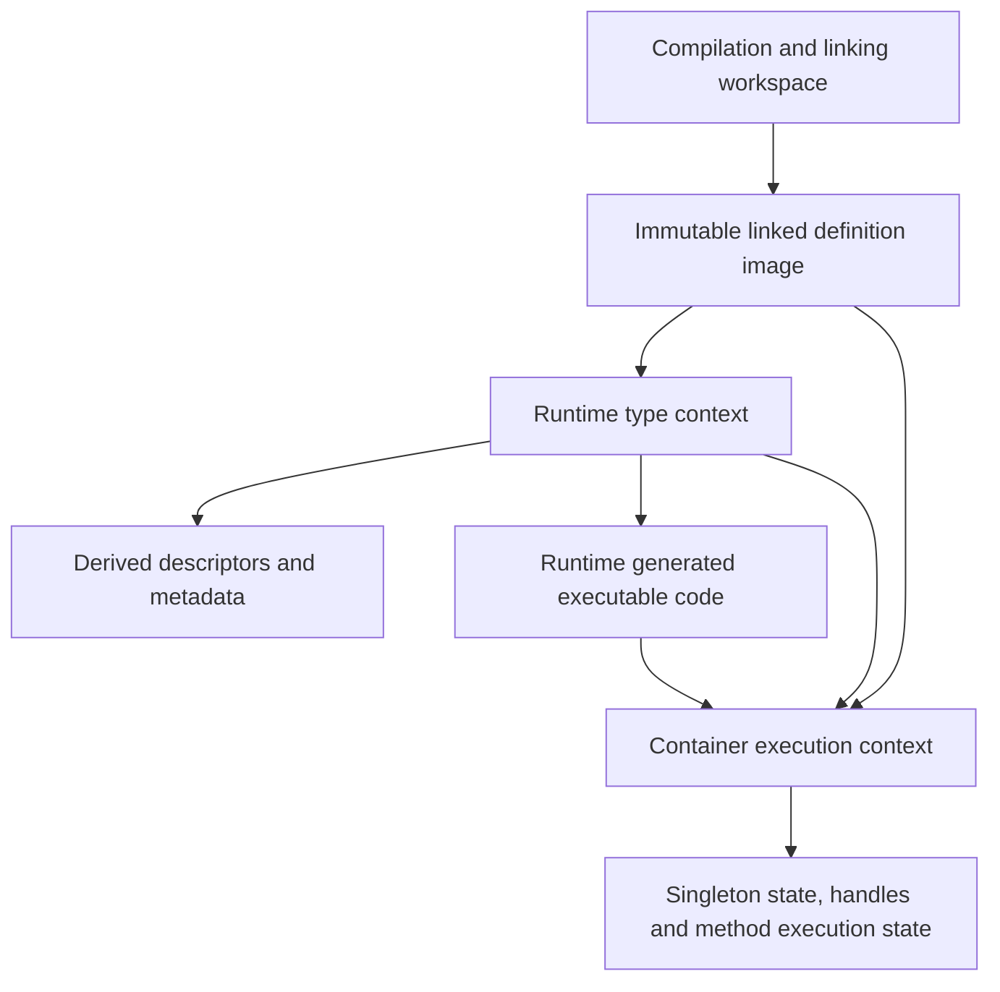

# Separating definitions, type metadata and execution state

Status: staged implementation in progress, 2026-09-25. The experimental branch
`lagergren/constant-pool-state-separation` implements the singleton execution-state boundary and
the first descriptor/index boundary, including late-generated field initializers, local reflective
parameterization, a separate type-relation table and an explicit definition-freeze boundary.
Scope 3 extends that boundary to late method/property delegation and prepares template-defined
native rebases before application publication. Scope 4 moves method initialization, decoded Ops,
frame layouts and debugger instrumentation into service-owned execution state, with same-image
interpreter regressions. Broader reflection and default frozen activation remain unfinished.
Scope 2 separates semantic metadata from descriptors; scope 1 routes ordinary entry, frame and
construction metadata through runtime descriptors. Freezing is still opt-in; this is not a
merge-ready activation change.
The correctness baseline is `lagergren/constant-pool-ownership-only`, extracted from
master `601a68e8b` with prerequisite `d8c6c3176`, initial extraction `65e5ce149` and the subsequent
narrowing that removes the general listener migration.
[The ownership audit](constant-pool-ownership.md) documents its changes, regressions and remaining
limits. The original embedding/Gradle/shutdown work remains on
`lagergren/constant-pool-ownership`. JIT development remains separate.

## Recommendation and decision boundary

A separation is plausible and would make ownership easier to explain. Start by moving singleton
execution state out of definition constants, in a separate commit/PR after the correctness
baseline. Measure that limited prototype before committing to a fully frozen runtime image.
Do not combine the full architecture migration with this extraction.

The full split is substantial: factories, reflection, method execution, native bootstrap and
metadata queries currently use the same object graph. Moving a few cache fields does not freeze
that graph, and freezing it immediately would break legitimate runtime type construction.
The stages below are being implemented as independently reviewable commits; each stage retains
its own validation gate before the full frozen-runtime model can be enabled.
The general error-listener architecture is a separate deferred project, preserved at
`archive/constant-pool-with-listener-migration` (`e90e5f8f8`) and on the original combined/errs
branches. It is not a prerequisite for these stages; this branch retains only the definition/cache
diagnostic ownership boundary using master's listener interface.

The existing ownership fixes remain necessary during migration. A destination must still be
explicit, and sharing a definition must still be distinguished from sharing a live value.
Freezing definitions removes some opportunities for accidental mutation; it does not decide
module compatibility, application isolation, diagnostic routing or synchronization for us.

## Why an immutable type system still has mutable pools

The [language design](x.md) says that a container's activated type system is immutable. That
constrains its declarations and relationships. It does not require every possible parameterized,
union, intersection or annotated type descriptor to have been materialized in advance.
Reflection can describe combinations of already-defined types without adding a declaration.

Today's implementation combines several distinct responsibilities:

| Responsibility | Current examples | Is it a disposable cache? |
|---|---|---|
| Compiled definitions and serialized constant indices | `FileStructure`, `Component`, `ConstantPool`, method code | No: these define the program and interpret its binary references |
| Canonical descriptors constructed on demand | `ensureParameterizedTypeConstant`, other pool factories | Not generally: canonical identity and indexing may be relied upon |
| Derived semantic metadata | `TypeInfo`, relation/variance/member maps on `TypeConstant` and related constants | Potentially, only if all inputs and diagnostic results are preserved |
| Native/runtime representations | templates, `ClassComposition`, reflective type handles | Context dependent; cannot assume portability between runtimes |
| Live execution state | singleton handles/waiters, method initialization, runtime annotation captures | No: clearing it can change observable behavior |
| Compiler working state | unresolved types, registers, validation recursion and diagnostics | Mutable, scoped to compilation; not runtime image data |

The ownership difficulties arise at several levels, rather than from caching alone. The audited
bugs include writing a source during adoption, choosing the wrong construction destination,
copying compiler state, retaining a request listener, and looking up a singleton in the wrong
container. Caches amplify these problems when they retain objects from another owner.

## Alternatives and their cost

| Option | Benefit | Limitation |
|---|---|---|
| Keep the corrected ownership model | Lowest migration cost; explicit destinations and isolated copies already fix demonstrated defects | Definitions, caches and execution state remain mixed; copies and reset logic remain necessary |
| Move execution state to side tables first | Gives singleton lifetime a clear home; permits testing shared definitions without shared values | Pools still create descriptors and metadata; this does not freeze them |
| Split linked images, descriptors, metadata and execution | Strongest structural boundary; may enable safe reuse and remove copies | Broad migration with native bootstrap, reflection and indexing consequences |
| Precompute every runtime type and freeze today's pool as-is | Superficially avoids a new descriptor layer | Not a general solution: runtime combinations and captured annotation values need on-demand representation |

The staged recommendation starts with the second option. Its results determine whether the
third option is worth pursuing. Keeping the corrected current model is a valid stopping point.

## Proposed boundaries

These are conceptual names, not a proposed final Java API.



### 1. Compilation and linking workspace

Keep mutable construction, unresolved constants, validation attempts, register allocation and
linking here. `FileStructure` and existing builders can initially keep their compiler APIs.
An explicit finalization step produces a complete linked image after validating references.
Compilation owns its request listener; no immutable image retains that listener. A future listener
API cleanup can tighten general null/branch contracts separately from this ownership boundary.

A compiler may discard or rebuild metadata as declarations change. That invalidation protocol
must remain distinct from memoization over a frozen runtime image. This design does not enable
parallel use of a mutable compiler or imply that its current structures are thread safe.

### 2. Immutable linked definition image

Own fixed declarations, method definitions, literal constants and the mapping from serialized
constant indices to definitions. References into another image carry an explicit image identity
and are resolved against a fixed dependency graph. Initially, identity can be an opaque token
per prepared image; do not invent a global content-addressed registry before it is needed.

Keep the XTC binary format unchanged in the first stages. Serialized indices remain local to
their image. Runtime-created descriptors must use a distinct reference domain, not silently
append to a serialized table or masquerade as a portable constant index. Audit `getPosition()`
consumers, frame constant arrays, relocation and switch dispatch before enforcing this boundary.

An image is publishable only after linking and structural native preparation have completed.
The image exposes read operations; attempts to register new definitions after publication fail
at the mutation boundary. A read that lazily decodes a body needs either a safely published,
immutable decoded value in a side table or eager decoding. It must not expose compiler-owned
mutable Ops or ASTs to several executions.

### 3. Runtime type context and derived metadata

Own an interner for immutable descriptors over a fixed image/dependency graph, plus separate
memo tables for derived facts. Runtime reflection asks this context to parameterize, combine or
annotate a type. A declaration can remain frozen while these descriptor tables grow.

Interning is not ordinary memoization: arbitrary eviction may break identity assumptions.
Its lifetime and growth need measurement and an explicit owner. A disposable relation cache
may be cleared only if recomputation has identical results, including diagnostic replay.
Neither table should retain a request listener, container service or captured object handle.

Query keys need every semantic input: image/generation identity, operands, type arguments and
any applicable access or resolution context. Native bindings belong in the key/context if they
affect the answer. Names alone are insufficient when a module is recompiled under the same name.
Start with context-local caches; sharing across contexts is a later optimization requiring proof.

Recursive calculations need calculation-local in-progress state and clear failure semantics.
Do not copy recursion guards or expose a partially calculated entry as a finished answer.
Immutable completed results can be published safely; synchronization and reentrancy still need
explicit design even when source definitions are immutable.

Diagnostics stored with metadata are immutable result values, replayed to the current request's
listener. Audit their payloads for retained AST/source/structure references before sharing them
across image lifetimes. Removing the listener reference alone does not establish bounded retention.

### 4. Container execution context

Own the live state associated with executing definitions: singleton values and initialization
coordination, reflective handles, native/template bindings, class compositions, and method
initialization state. Some representations may later prove shareable within a runtime; their
initial placement should reflect the narrowest proven lifetime.

The singleton lookup is conceptually:

1. Resolve the definition in the requesting container's type context.
2. Select the permitted value owner using explicit module-sharing ancestry.
3. Canonicalize the definition key in that owner's context.
4. Obtain or initialize the value in that owner's execution state.
5. Publish success or release failed initialization and notify waiters there.

Shared primitive/core values can belong to the native root. Unshared application singleton
state belongs to each application or nested container. Two containers reading the same image
do not automatically share a service, singleton constructor result or mutable handle.

Definition-sharing and value-sharing policies must be independent and visible in APIs. Type
compatibility does not grant authority to reuse a live object. Existing `getOriginContainer`
behavior is the starting contract, not an excuse to broaden sharing to every equal module name.

Execution-owned state is released with its existing owner. This plan does not implement socket,
watcher, timer or HTTP shutdown. Those mechanisms remain a separate part of the embedding series.
It must integrate with them later without forcing shutdown changes into this correctness branch.

## Source areas that constrain the design

| Area | Current behavior to preserve or separate | Likely first change |
|---|---|---|
| `ConstantPool`, `Constant.registerConstants`, `TypeConstant.registerConstants` | Adoption, canonicalization and definition ownership are combined | Separate read/resolve from destination construction; retain explicit destination adapters |
| `FileStructure` copy/merge/link, `MethodStructure.cloneBody` | Prepared structures are copied to isolate caches, code and execution state | Classify each copied field before eliminating copies |
| `SingletonConstant`, `ConstHeap`, `Container`, `Utils` | Constant objects hold handles/waiters; owner dispatch is necessary | Move initialization state to an owner-local table keyed by canonical definition |
| `TypeConstant`, `TypeInfo`, parameterized/signature/property constants | Semantic caches and recursion state live beside definitions | Move one proven-pure calculation at a time into the type context |
| `MethodStructure`, `Frame`, service-local operation caches | Method initialization and decoded code have different lifetimes | Separate execution flags from immutable method body data; retain service-local runtime caches |
| `ClassTemplate`, `NativeContainer` | `markNativeMethod` / `markNativeProperty` can synthesize structural overrides | Finish structural preparation before freeze, or design an explicit native binding overlay |
| `xRTType`, `xRTTypeTemplate` | Reflection constructs descriptors and handles on demand | Route descriptors through the type context, handles through the execution context |
| `HandleConstant`, annotated types | Runtime annotation arguments can capture actual handles | Keep captures in an execution-owned representation; never put them in a globally shareable type key |
| Native template static `INSTANCE` and cached types/handles | Some state is classloader-wide today | Audit cross-runtime assumptions before publishing reusable images; do not call this solved |
| `TypeInfo` diagnostics and its build-local recorder | Metadata must not capture request sinks | Preserve request replay; inventory payload retention before broad cache sharing |

A compatibility facade can temporarily keep familiar methods, but it must require the relevant
context at construction/runtime boundaries. For example, a definition owner accessor remains a
read operation; `typeContext.parameterize(definition, arguments)` expresses construction;
`executionContext.singleton(definition)` expresses live-value access. Do not replace the old
ambient thread-local pool with an ambient thread-local type context under a new name.

Cross-image operations also remain explicit. A library definition may be read from image A while
a specialized descriptor is needed in context B. Either B can reference A through its dependency
graph or the operation must reject/translate that reference. Equal names do not establish equal
generations. Values capturing a container require additional lifetime checks even when their
underlying type definitions are compatible.

## Reviewable implementation sequence

| Stage | Scope and deliverable | Deliberately excluded | Evidence needed to proceed |
|---|---|---|---|
| 0. Correctness baseline | This extraction and ownership audit | Architectural implementation, Gradle modes, new JIT work | Independent unit and XDK integration passes |
| 1. Mutation inventory | Classify writes after activation; optional counters for registrations, copies and cache misses | Freeze enforcement or broad cache rewrite | Reproducible report naming mutation sites and lifetimes |
| 2. Singleton prototype | Owner-local initialization table; migrate handles, waiting and failure release together; narrow adapter for existing callers | TypeInfo/interner rewrite, native resource shutdown | Existing singleton regressions plus same-image isolation/sharing tests |
| 3. Descriptor boundary | Runtime descriptor interner distinct from compiled constant indices; explicit resolution context | Global interning, binary format changes | Reflection, cross-image resolution and index-domain tests |
| 4. Metadata separation | Move selected derived metadata and diagnostics to context-owned memo tables; later separate remaining runtime handles/method flags | Assuming every TypeInfo is context-free | Cache-clear equivalence, recursion/failure and generation-isolation tests |
| 4a. Generated executable code | Finish image-level synthesis before publication; move late delegation bodies and per-composition initializers into a context-owned executable overlay | Arbitrary eager generation of all generic specializations; mutable generated Ops in shared images | Delegation, accessors, const helpers, reflection and debugger tests against an unchanged image |
| 5. Frozen image | Complete native preparation; prohibit definition writes; immutable body publication | New container models or cross-build reuse | Full interpreter regressions with freeze guards enabled |
| 6. Optional sharing | Reuse proven immutable images/metadata across requests with measured retention policy | Cross-generation name-based cache, arbitrary interner eviction | CPU/allocation/retained-memory comparison and ownership assertions |

Each row is a scope boundary, not necessarily a single small PR. Stages 3–5 may need further
splits after stage 1's inventory; do not assign reliable effort estimates without that evidence.
The singleton prototype is the smallest useful architectural experiment, but even it must migrate
all initialization/failure paths rather than just moving the handle field.

Stage 4a is required because a metadata lookup can synthesize executable methods. It must be
coordinated with stages 3 and 4; a semantic cache cannot be declared image-pure while its lookup
still inserts methods into the image. The detailed inventory below identifies those paths.

Stages 2 and 4 should keep definitions usable by existing code through narrow transitional APIs.
Every intermediate commit must compile both interpreter and the existing shared JIT sources.
New JIT runtime behavior and its validation belong on the `JIT` branch; coordinate shared API
changes there rather than importing the archived embedding JIT implementation here.

## Validation plan

The current tests establish a correctness baseline, not proof of the proposed design. Add the
following with their corresponding stages; use assertions and deterministic barriers, with
bounded waits only as hang guards:

- Run two applications against the same image: unshared services/singletons stay independent;
  explicitly shared ancestors and native primitives preserve their expected identity.
- Exercise sibling and grandchild containers, singleton switch lookup, failed initialization,
  retry and multiple waiters. Coordinate concurrent waiters explicitly, without sleeps.
- Query with no ambient pool and with an unrelated ambient pool; verify both source integrity
  and destination identity. Dispatch work to another thread with its explicit context.
- Build derived descriptors after activation while asserting no definition-image mutation and
  stable serialized indices. Reject writes at every public structural mutation entry point.
- Run the same metadata query cold, warm and after clearing only disposable memo tables;
  require equivalent results and diagnostics for each request.
- Recompile a module under the same name with changed declarations; verify the old and new
  image contexts never reuse incompatible descriptors or metadata.
- Force recursive-query failure and retry; verify partial results and in-progress guards are
  not published as completed entries. Test synchronized canonicalization with barriers.
- Exercise runtime annotations that capture values: they must remain in the capturing execution
  context or follow a deliberately defined transfer rule, never become globally shared literals.
- Check every removed copy/reset against its former isolation purpose. A passing simple type
  comparison does not validate method initialization, handle retention or register ownership.

Keep distribution-dependent `.x` tests under the XDK test task with declared build prerequisites;
unit tests construct their own metadata. Do not add an automatic all-execution-modes or broad
JIT CI matrix for this work. Measure retention separately from correctness assertions; forced-GC
timing is not a deterministic unit-test oracle.

## Performance experiment and stop conditions

Use the same interpreter workload and build inputs for baseline and each prototype. Record cold
preparation, repeated preparation/execution, CPU stacks, allocation and retained heap. Separate
module copying/linking, type metadata construction, singleton initialization and program work.
An explicitly requested benchmark may disable task caching to ensure execution; normal build
behavior and CI configuration stay unchanged.

The potential win is avoiding repeated copying/rebuilding of proven immutable data. The costs
are extra context/table lookups, retained canonical descriptors, synchronization, and migration
complexity. No speedup is assumed, and this document adds no heap/metaspace flags.

Set acceptable performance and memory budgets after recording a baseline. Stop or revise a
stage if it cannot preserve identity/isolation, if cache keys need unbounded hidden context,
if retained state crosses its owner's lifetime, or if the measured benefit does not justify
additional indirection and maintenance. Structural clarity can justify a small change on its
own; a wholesale rewrite needs stronger evidence.

## Decisions for the next discussion

1. Approve only mutation inventory and the singleton prototype first, or defer implementation?
   Recommendation: those two bounded steps, keeping this extraction independently reviewable.
2. Should compiled definitions remain represented by existing ASM classes behind a read-only
   facade, or become a new immutable representation? Start with the facade and guarded writes;
   decide after inventory whether its invariants are enforceable without pervasive exceptions.
3. Which metadata is genuinely image-pure? Establish this per calculation before sharing it.
4. Which native values are intentionally root-wide, runtime-wide or classloader-wide? Record
   that policy explicitly before supporting several reusable images/runtimes in one host.

A successful first prototype would make the singleton definition describe a singleton, while
its selected container owns the running instance and initialization state. That is a useful,
reviewable boundary even if we decide not to undertake the larger frozen-image architecture.

## Singleton separation experiment

The local experiment is on `lagergren/constant-pool-state-separation`, forked at `bda7556e7`.
The ownership-only branch remains the reviewable correctness baseline. This experiment implements
stages 1 and 2 only; it does not freeze definitions or change the binary format, general listener
API, shutdown protocol, Gradle plugin or JIT execution. Existing shared JIT sources must compile.

### Mutation inventory before implementation

This is an inventory of the interpreter's definition/metadata boundary and its known blockers,
not a claim that arbitrary runtime code has been proven immutable. Compiler writes before
activation remain valid. None of the rows below authorizes sharing a whole FileStructure.

| State and mutation sites | Actual lifetime / meaning | Action in this experiment |
|---|---|---|
| `SingletonConstant.getHandle`, `setHandle`, `markInitializing`, `getInitializationWaiter`, `abortInitialization`; reset in `adoptedBy` | Owner-container value, initializer fiber and completion future; not disposable metadata | Move together into the owner's `ConstHeap`; retain ancestor selection in `Container` |
| `Utils.initConstants`, `ObjectHandle.DeferredSingletonHandle` / `InitializingHandle` | Initialization dispatch, recursion, suspension and failure cleanup | Resolve state from the explicit container; a recursive handle must retain the specific owner-local state |
| `xEnum.initNative` / `createConstHandle`, `xPackage.ensureConstHandle`, `ClassTemplate.createPropertyRef`, `ConstHeap.relocateConst` | Bootstrap values, enum structs, package/module values, lazy refs and relocation | Migrate every singleton state read/write, preserving the existing owner/service protocol |
| `ConstantPool.register` and `ensure*TypeConstant` factories | Canonical definition references and on-demand runtime descriptors; indices remain pool-local | Keep registration and existing destination rules; an interner is not a disposable cache |
| `TypeConstant.ensureTypeInfo`, relation/variance maps, normalization and recursion guards; property/signature caches | Derived facts plus in-progress computations; compiler invalidation differs from runtime memoization | Keep current adoption/reset rules; later separation requires full query keys and failure semantics |
| `TypeConstant.ensureTypeHandle`, `FSNodeConstant.setHandle`, `FileStoreConstant.setHandle`, `HandleConstant` | Runtime representations or captured live values with distinct lifetime rules | Do not move or clear these as if they were singleton state |
| `MethodStructure.ensureInitialized`, `ensureRuntimeInfo`, `ensureCode`, `cloneBody` | Execution flag, variable/scope sizes, lazily decoded mutable code and copied compiler state | Keep independent method bodies and all application copies; same-definition singleton tests do not imply safe same-image execution |
| `ClassTemplate.markNativeMethod` / `markNativeProperty`, native template `INSTANCE` fields | Structural bootstrap overlays and classloader-wide runtime bindings | No freeze guard or multi-runtime sharing claim; complete native preparation needs a separate design |
| `Container` template/composition maps and `ServiceContext` operation caches | Container/service-specific execution metadata | Already have explicit runtime owners; retain their lifetimes |

The desired change is structural: after migration a copied singleton definition has no execution
state to clear. The live value still needs module-sharing owner selection, and changing to a table
does not make the service scheduler or mutable definition graph generally thread safe.

### Generated methods and other freeze blockers

Generated executable code is a distinct responsibility, not simply a cache to clear. In particular,
metadata queries can currently create methods and insert them into the declaration tree. Before
sharing a frozen image, resolution must distinguish an image-defined method from an executable
implementation supplied by the current type/execution context. The proposed runtime context needs
an executable overlay in addition to its descriptor interner and semantic memo tables.

| Concrete source path / trigger | What changes today | Proposed boundary and required checks |
|---|---|---|
| `FileStructure` construction/linking → `synthesizeChildren` → `ClassStructure.synthesizeConstInterface(true)` | Const/enum equals, compare, hash and Stringable support declarations; `synthesizeAppendTo` can generate code | Complete declaration-level synthesis before publication; test const equality, hashing, ordering and custom `toString`/`appendTo` behavior after freezing |
| `ClassComposition.ensureAutoInitializer` → `ClassStructure.createInitializer` | Builds a transient method for the concrete struct field layout, registers its constants, caches the body in the composition; it is not attached as a declaration child | Keep the executable in the owning composition/context; reference image definitions without writing them; test generic fields, annotations, injected fields and independent variable/scope counts |
| `MethodInfo.ensureOptimizedMethodChain` → `ClassStructure.ensureMethodDelegation` | Creates a delegating method on the host class, assembles Ops, stores the body in metadata | Move late bodies to the executable overlay; key by image, resolved host/signature, delegate and applicable native bindings; test generic and atomic delegation, failure/retry and concurrent first lookup |
| `PropertyInfo.createDelegatingChain` → `ClassStructure.ensurePropertyDelegation` | Creates a host property if absent and synthesizes getter/setter methods | Keep semantic property facts separate from generated accessors; test both reads and writes, inherited visibility and annotation behavior |
| `ClassTemplate.markNativeMethod` / `markNativeProperty` | Marks methods native; can insert synthetic overriding methods/properties and alter getter behavior | Complete stable bootstrap declarations before freeze; represent later native bindings in an explicit overlay; test inherited native overrides and dispatch after a cold lookup |
| `xRTType.invokeStructConstructor` and `xRTFunction` constructor/function handles | Runtime callable representations and parameter/type descriptors, sometimes capturing an outer value | Keep captured values in execution state and descriptors in the type context; a synthetic handle is not necessarily a new declaration; test reflective construction with/without an outer instance |
| `ClassStructure.ensureSyntheticMethod` / `ensureSyntheticProperty` | General structural insertion APIs on synthetic classes | Include in structural mutation guards. No production caller was found for `ensureSyntheticMethod` in this inventory; do not count it as an exercised runtime path |
| `MethodStructure.ensureCode` / `ensureRuntimeInfo`, code assembly/registration, `MethodBody.setMethodStructure` | Lazy decoding, mutable Ops/registers, local constant arrays and calculated frame layout | Decode immutable templates or keep executable copies in the overlay; frame sizing must match the selected body, including generated constructors; verify cold/warm execution and cross-context isolation |
| `ServiceContext.insertBreakPointOp` | Replaces entries in an executing Op array, later restores them | Debugger instrumentation must be execution-owned even if decoded code is shared; two executions of one image must not inherit each other's breakpoints |
| `TypeInfoReal` optimized chains and member maps, `TypeConstant` relation/variance/in-progress state | Reads can populate maps, recurse, or trigger the synthesis above | Classify individual calculations before moving them; retain context/generation keys and immutable diagnostic values, and test failed recursion without publishing partial entries |
| `TypeConstant.ensureTypeHandle`, reflective cached compositions/empty arrays, native static `INSTANCE` and value fields | Handles and representations may be container-, runtime- or classloader-owned rather than image-pure | Audit each sharing policy before using several images/runtimes in one host; a metadata-table move cannot repair classloader-wide ownership |
| `FSNodeConstant` / `FileStoreConstant` handles, annotated `HandleConstant`, frame-dependent register constants | Execution values, captures or compiler register dependencies are embedded in constant objects | Separate each according to semantics; never evict a captured annotation argument or persist a frame-relative value as an image constant |

The overlay is a proposal, not an implementation in the singleton prototype. It should expose
lookup/build operations through an explicit context; generated method identities must not reuse
serialized constant positions as a second index domain. Publish completed bodies atomically, keep
construction recursion local to an attempt, and ensure reflection/dispatch consult the same view.
Do not recreate a global ambient pool under the name of a method-generation context.

There are three distinct work items before freeze enforcement:

1. Finish stable linking, const/helper synthesis and structural native preparation before the
   image is published. Preserve the compiler's ability to mutate its own workspace.
2. Redirect genuinely late, specialization-dependent generation into the executable overlay.
   Retain service-local caches and execution-specific instrumentation outside immutable bodies.
3. Guard every structural insertion/replacement and image registration path, then execute the
   workloads above with guards enabled. Also compare declaration trees and serialized indices
   before/after execution; merely observing no calls to one factory is insufficient.

This inventory names source-confirmed paths, not an exhaustive immutability proof. New guard
failures become explicit inventory entries rather than exceptions that silently allow writes.
The frozen-image stage cannot pass its gate while an unclassified runtime write remains.

### Reproducible comparison

`xdk/src/test/benchmarks/SingletonStateBenchmark.java` is an opt-in Java source launcher outside
Gradle's test source set. It compiles the existing assertion-only `ownership/Singletons.x` fixture
once, then measures native bootstrap and repeated preparation/execution of fresh applications
under that root. Each run retains the existing definition copies. It reports wall time, whole-JVM
CPU time and total thread allocation; it introduces no CI task, JVM sizing flags or timing assertions.

From the repository root, build the installed distribution and run:

```sh
./gradlew :xdk:installDist
java -ea -cp xdk/build/install/xdk/javatools/javatools.jar \
    xdk/src/test/benchmarks/SingletonStateBenchmark.java \
    xdk/build/install/xdk xdk/src/test/resources/ownership/Singletons.x 8
```

Use multiple fresh JVMs for each revision. Report the cold iteration separately and use the same
warm iterations on both revisions. Do not interpret cumulative allocation as retained memory or
attribute changes in copying/linking to this prototype: those algorithms remain unchanged.
Comparing live heap requires a separate controlled collection/retention experiment; no forced-GC
assertion belongs in the tests. A small timing difference in this workload is not evidence of a
general XDK-build speedup.

Baseline validation at `bda7556e7`: 14 focused Java cases and 8 XDK ownership cases executed with
zero skipped tests. Inspecting stderr found that the existing failure fixture accepted a runtime
array-bounds exception before its intended constructor exception. The comparison must first fix
the missing constructor local-variable slots and require the expected exception type/message;
that prerequisite is isolated from the state-table migration in `846bf5315`. The strengthened
test fails on `bda7556e7`; all 8 XDK ownership cases and formatting pass with the fix, without the
array-bounds error on stderr. Use `846bf5315` as the behaviorally valid performance baseline.

### Implemented singleton boundary

`SingletonConstant` now contains definition data only. `Container.ensureSingletonState` selects
the permitted ancestor, canonicalizes the definition there, and gets its unique `SingletonState`
from that container's `ConstHeap`. The entry contains the value, initializing fiber and completion
future. Native enum bootstrap, deferred/recursive handles, lazy refs, package/module creation,
relocation and initializer completion/failure all use this boundary. The old no-context runtime
methods on `SingletonConstant` are removed; retaining them would require guessing a value owner.
`ensureSingletonConstant` remains a definition canonicalization operation, not a value accessor.

The map's atomic insertion only creates an empty entry; it never invokes user code. Initialization
still runs on the selected owner's main service. Concurrent lookup of an already-canonical key is
tested; this does not authorize concurrent pool mutation or arbitrary state writers. Success and
failure clear bookkeeping before notifying waiters. Repeated recursion keeps one placeholder;
after failure that placeholder reports an uninitialized value instead of dereferencing null.

Tests now exercise two unshared containers using the exact same definition object, as well as
explicit ancestor sharing, copied definitions, mixed-owner dispatch, multiple waiters, failure
and retry, recursion, and lookups with no/unrelated ambient binding. The `.x` fixtures run twice
under one native root with independent application definitions. `SingletonPaths.x` additionally
covers user/native enums, a static lazy reference and repeated circular initialization failure.

That fixture exposed another baseline bug: after `ref.get()` initializes a static lazy property,
ordinary constant access skipped dereferencing the already-assigned lazy wrapper. It then failed
an integer comparison with a Java ClassCastException. The same fixture reproduced this using the
saved `846bf5315` runtime. The heap now always obtains a lazy property's referent; raw reference
access still reads the owner's state entry without evaluating it. This is a correctness fix, not
an architectural performance gain. The before/after benchmark uses the unchanged `Singletons.x`
workload from `846bf5315`, which does not exercise that lazy-reference bug.

The prototype does not remove application/method copies, reset rules for other constants,
generation-sensitive metadata, native statics or shutdown machinery. Same-definition tests prove
the singleton boundary only, not safe execution against a fully shared mutable FileStructure.

### Validation and measured outcome (2026-09-24)

The local commits separate the work for review:

- `846bf5315`: constructor register-slot prerequisite and the stronger failure assertion.
- `d90948de2`: mutation inventory, generated-method plan and opt-in benchmark; production behavior
  is identical to `846bf5315`, so this is also a convenient checkout for reproducing the baseline.
- `e6bf7c16d`: owner-local singleton state, migrated readers/writers, focused tests, and the
  assigned-lazy-referent correction described above.
- The subsequent measurement commit adds the raw comparison results and optional heap-inspection
  pause. It does not change production behavior or attach a benchmark task to CI.

Verification of the prototype:

- `:javatools:test`: 468 discovered, **428 executed successfully**, 40 existing disabled/skipped,
  zero failures/errors. All 10 `SingletonOwnershipTest` cases executed, including barrier-based
  concurrent lookup; the constant-heap and continuation/failure tests also ran without skips.
- `RUN_INTEGRATION_TESTS=true ./gradlew :xdk:test --rerun --console=plain`: **all 34 passed**, zero
  skipped/errors/failures. The ownership class includes both assertion-only `.x` fixtures, each
  executed in two applications; its stderr is empty.
- Shared JIT sources and `:javatools_jitbridge:compileJava` compile. No new JIT execution behavior
  is introduced or claimed. `spotlessCheck` and `git diff --check` pass.

Three alternating baseline/prototype pairs used Java 25 (Corretto 25.0.0), JVM defaults, the same
installed libraries and the same `Singletons.x` source. Each JVM ran eight fresh applications.
Iteration 0 is cold; warm results below are the median of iterations 3–7 within each JVM, then
the median of the three JVM medians. Source compilation and native bootstrap are excluded from
the preparation/execution rows. Raw measurements are retained in
[singleton-state-results.csv](../xdk/src/test/benchmarks/singleton-state-results.csv).

| Phase | Baseline wall ms | Prototype wall ms | Baseline CPU ms | Prototype CPU ms | Baseline allocated MB | Prototype allocated MB |
|---|---:|---:|---:|---:|---:|---:|
| Native bootstrap | 610.7 | 761.3 | 1678.2 | 1940.8 | 155.72 | 150.71 |
| Cold preparation | 154.4 | 190.1 | 514.4 | 465.7 | 114.07 | 109.51 |
| Cold execution | 1067.9 | 1542.8 | 2818.9 | 3379.2 | 686.67 | 673.47 |
| Warm preparation | 121.6 | 127.3 | 163.0 | 160.2 | 113.65 | 108.30 |
| Warm execution | 932.5 | 902.1 | 1561.7 | 1497.6 | 681.05 | 664.64 |

These are observations, not a speedup claim or a performance acceptance threshold. Warm execution
medians ranged **908–1226 ms before** and **867–1078 ms after**; cold execution ranged **1026–2558 ms
before** and **1079–1644 ms after**. Even allocation varied between JVMs: baseline warm execution
medians ranged 665.10–681.10 MB, versus 664.59–665.04 MB for the prototype. That baseline variation
is much larger than the singleton fields/table involved; attributing the median difference to
singleton storage would be unjustified. Host load/JVM warmup
and differing metadata work make three pairs insufficient to prove a small regression absent.
Do not use the slower cold median or faster warm median alone as a conclusion.

Separate JFR profile runs still show constant registration, method/child constant registration,
definition linking/copying and TypeConstant work among the recurring XVM stacks. Singleton-state
lookup has too few samples to quantify its cost. Those recordings include startup and compiler
work and are not a phase-specific CPU attribution; their timings are excluded from the table.

Live heap histograms after eight iterations retained one native `ConstHeap` and 431
`SingletonConstant` objects. Their shallow footprint fell from **27,584 to 20,688 bytes** (64 to
48 bytes each). The prototype retained **7 `SingletonState` entries, 224 shallow bytes**, plus
the new map/table/node overhead. This confirms state is allocated for used definitions rather
than reserving execution fields in every constant. It is not a whole-process retained-memory
or leak guarantee; class histograms do not assign transitive retained size to an owner.

For a separate live-heap probe, append `--heap` to the benchmark command. After all iterations it
prints the PID and waits for Enter while retaining the native root. Run
`jcmd <pid> GC.class_histogram`, then press Enter. This controlled collection is outside timing measurements
and outside CI/tests. A profiling run can separately add
`-XX:StartFlightRecording=filename=singleton.jfr,settings=profile`; do not mix those timing results
with unprofiled runs.

The result supports keeping this small ownership boundary: definitions no longer need singleton
handle/waiter reset logic, and identical definitions can coexist with isolated values. It does
**not** yet justify the larger rewrite for performance. The following descriptor/index prototype
tests the next correctness boundary. Existing application copies remain until method flags,
mutable Ops, synthesis and the other inventory rows are handled.

## Descriptor/index and initializer prototype

This is the first slice of stages 3 and 4a. It establishes an executable path through a separate
descriptor store; it does not declare either stage complete.

### Owners, indices and API order

1. Complete module linking and native preparation using the existing image pools.
2. Obtain `Container.getTypeContext()` when runtime derivation is first needed. Its lazy holder
   creates one context for that container and captures the exact linked dependency pools.
3. Use `RuntimeTypeContext.intern(type)` or `parameterize(base, arguments)` for context-owned
   descriptors. Imports are checked before structural equality can find a cached result. A
   same-named type from another compilation or runtime context is rejected. Linked dependencies
   are accepted by identity and must resolve to the module generation selected by this image.
4. Generated initializers use the context's descriptor pool. `RuntimeMethodStructure` keeps that
   owner even though its parent module provides declaration lookup. The method is never inserted
   into the module's children. Assemble its code with its own pool, then execute through the
   existing composition; an attempt to assemble against another pool is rejected.
5. Retain the context and generated methods with the container/composition. Do not share or evict
   canonical descriptors across containers. Captured frame-dependent values are rejected.

`ConstantPool` remains a factory/interner adapter inside the context to avoid duplicating the
existing type algebra. That inheritance is transitional, not a claim that caches have all been
extracted. Runtime constants have position `-1`; image-index lookup, pool serialization and bulk
image registration reject this store. Method-local `Op.ConstantRegistry` indices still work:
they select entries in that method's constant array, independently of XTC image positions.
No XTC format change or global descriptor index was introduced. The low-level factory adapter
requires operands to be imported first; callers should prefer the context's checked operations.

### Changes and the problems they address

| Change | Why it is needed | Classification |
|---|---|---|
| `RuntimeTypeContext` and its descriptor pool | Give derived types a context and lifetime without appending to image tables; reject another generation before equality-based interning | New architectural boundary |
| `ConstantPool.hasSerializedIndices()` and guards | Existing registration assigns every entry an image position; runtime descriptors must not silently borrow that domain | Architectural prerequisite; binary pools retain their existing behavior |
| `RuntimeMethodStructure` | A transient method's module parent otherwise selects the image pool during later assembly; generated code needs an explicit owner | Architectural prerequisite |
| `ClassComposition.ensureAutoInitializer` / `ClassStructure.createInitializer` | Route real late code generation through the context. Select the identity from the composition's type, rather than the native template's potentially different source image | Production migration; strict checks exposed the old source/destination mismatch |
| `NativeRebaseConstant` traversal/adoption | A native implementation wraps an interface identity. Previously only its name and parent were traversed/adopted, leaving the wrapped interface in the source pool. Initializer identities now use the selected image's declaration instead of the native pseudo-class | Previously incomplete ownership transfer, exposed while exercising lazy references |
| `TypeConstant.getDefaultValue(destination)` | An initializer can request a default not yet represented in the image. Create that constant in the descriptor store; existing declaration values are imported by the method's local registry | Explicit destination for generated defaults |
| `Frame` type checking | Equal positions can belong to unrelated pools, and all runtime descriptors have position `-1`. Compare canonical objects before computing the type relation. Keep the custom resolver's auxiliary argument separate | Invalid identity shortcut in the optional `DEBUG` assignment checker; ordinary execution does not enable that checker |

### Evidence and remaining work

`RuntimeTypeContextTest` uses small Java-built images, without installed XDK assumptions. It
checks derivation, previously unused defaults and late code assembly against a read-only source image, unchanged constant
entries/positions and declaration children, exact dependency imports, conflicting generations,
separate contexts over one image, native wrapper adoption, captured-value rejection, and concurrent canonical publication
with no ambient pool. Concurrency is coordinated by latches; timeout is a failure guard only.

`RuntimeDescriptors.x` runs through the interpreter in two fresh applications sharing a native
root. Generic `Box<Int>` and `Box<String>` instances check generated field defaults and independent
mutable fields. The Java integration test also checks the actual initializer's owner and local
constant references, and snapshots the image table before descriptor/initializer generation.
Composition/metadata preparation occurs before that snapshot because it is still image-backed.
The existing nested-container, lazy-reference, native-enum and singleton regressions exercise
other initializer paths.

Final verification on 2026-09-24:

- `./gradlew :javatools:test --rerun spotlessCheck --console=plain`: 476 tests discovered,
  436 passed, 40 existing skips, no failures/errors. All eight new descriptor tests executed.
- `RUN_INTEGRATION_TESTS=true ./gradlew :xdk:test --rerun --console=plain`: all 35 tests passed,
  no skips/failures/errors. This also rebuilt the distribution and compiled the JIT bridge;
  it did not execute the JIT.
- Counts were read from JUnit XML. `spotlessCheck` and `git diff --check` passed. No Gradle
  task wiring, CI dependencies or default execution modes changed.

The reflection migration below covers parameterization together with handle/composition creation.
Merely changing `xRTType.parameterize` would be misleading: the old `TypeConstant.ensureTypeHandle`
and `Container.resolveClass` paths registered results back into the container's image pool.
Metadata still lives on `TypeConstant`, native/bootstrap preparation still edits structures,
and delegation/accessors/const helpers/debugger code still have separate generation paths.
Those are remaining work, not exceptions hidden behind the new context. The prototype neither
removes image copies nor proves shared-image concurrency, JIT execution or a performance gain.

The remaining index audit also includes `OpCallable`'s `A_SUPER` return-type resolver, which still
uses an image position. The migrated initializers are static zero-argument functions and do not
emit that operation. Migrate that resolver before moving arbitrary method bodies into the overlay.
The existing `ModuleStructure.markReadOnly` path also calls `getVersions()` for fingerprints,
although their `getVersionConstant()` rejects that use with assertions enabled. The focused
freeze tests use bundled declarations; general fingerprint freezing needs its own fix in stage 5.

## Reflective handle ownership

This is an independent prerequisite to the reflection migration, committed separately from
descriptor construction and semantic cache changes. `TypeConstant.ensureTypeHandle(container)`
now delegates to a container-owned handle map. A compiled type no longer retains a composition
and lazy reflective fields from the first container that requested its handle. Repeated requests
within one container return the same handle; two containers executing the exact same definition
receive independent handles. Core singleton value sharing remains unchanged.

This fixes an execution-lifetime mismatch; the old file-per-application arrangement usually
hid it by giving each application its own type constant. Handle construction occurs outside
`computeIfAbsent` because composition creation can recursively request other handles; publication
uses `putIfAbsent`. Foreign handles retain the existing uncached behavior. This commit deliberately
keeps the existing image registration path; moving the cache alone does not separate descriptors.

`ConstantPoolOwnershipTest.reflectiveHandlesBelongToContainersEvenWhenDefinitionsAreIdentical`
checks distinct handles and composition owners with the same `FileStructure`, plus repeated
lookup identity in both containers. The opt-in ownership integration suite passed on 2026-09-24
with no skipped tests, rebuilding the distribution rather than assuming compiled libraries exist.

## Local reflection through the descriptor context

This is the next separate commit after reflective handle ownership. Local `Type.parameterize`
imports its operands into `RuntimeTypeContext` before normalization; local relational operators
do the same before combining types. `Container.ensureTypeHandle`, `resolveClass`, class access
wrappers and canonical reflective compositions preserve the runtime descriptor owner. The image
preparation path remains for compiled types. Cache keys distinguish these two domains even when
their types are structurally equal, and context validation precedes descriptor cache lookup.

The template's native inception identity is a binding selected by the runtime. Resolve that
identity in the container's prepared image before importing it into the descriptor store. This
is intentionally different from registering a derived `Array<T>` back into the image: the native
binding identifies the declaration, while its actual parameters remain runtime descriptors.
`Object` metadata bootstrap now traverses constants directly; its previous integer-index loop
failed as soon as a descriptor composition needed metadata in a store without serialized indices.

Ownership rejection has its own `IncompatibleTypeOwnerException`. Reflection catches only this
expected input failure and reports Ecstasy `InvalidType`, with the ownership reason. It no longer
catches arbitrary `RuntimeException` or performs handle initialization inside that catch. Internal
normalization and handle bugs propagate instead of being disguised as a type-system mismatch.
The diagnostic also works when the parameter list is empty.

Evidence includes `RuntimeDescriptors.x` parameterization with repeated, distinct and omitted
arguments, plus nullable relational construction. The Java test snapshots image entries and
positions while creating an unused generic descriptor, its reflective handle and its ordinary
class composition. It also checks native array composition ownership. A handle from another
descriptor context stays foreign; direct composition creation in the receiving context rejects it.
Standalone descriptor tests check the specific ownership exception and propagation of an injected
internal normalization failure, without requiring compiled libraries.

This is a local-reflection boundary, not a blanket migration of every reflection operation.
Foreign parameterization retains its existing source-side path with an explicit common-pool check;
moving foreign dispatch needs an identified source context and remains separate. Constructor
function handles, annotations with captured arguments, property/method reflection and legacy
image-backed metadata still require migration. No source-image freeze, cross-container descriptor
sharing or removal of application copies is implied.

## First semantic-cache split: type relations

This is a separate commit after local reflection. `TypeRelations` owns completed assignability
results. `TypeConstant` retains the type algebra but no longer holds a relation map or a per-type
thread-local recursion set. Each image pool and runtime descriptor store has an independent table,
created through a final bound lazy holder. The adapter remains on `ConstantPool`; the semantic
table is a separate object and is not part of interning or serialization.

The runtime context exposes `calculateRelation(source, destination)` and `clearRelations()`.
Both operands are imported before equality shortcuts. A mixed image/descriptor comparison also
selects the descriptor store before any cache lookup, preventing the image table from retaining
a derived runtime type. Other descriptor contexts and image generations are rejected rather than
folded by equal names. Compiler comparisons between image pools retain their existing destination
selection rules.

### Completed results versus calculation state

- A completed result is an immutable `Relation` keyed by ordered, owner-canonical source and
  destination types. Access modifiers and parameters are included in those types.
- In-progress queries belong to the current thread's calculation. Recursion returns the existing
  conservative `INCOMPATIBLE` answer to the immediate caller; it does not publish that provisional
  answer to other queries or threads.
- A nested result records which active ancestors it depends on. It cannot be published while
  those dependencies remain. When the ancestor completes, its self-dependency is resolved and its
  completed result can be cached. Independent subqueries remain cacheable.
- Queries affected by the scoped auto-narrowing context bypass caching, and that dependence
  propagates to their callers. Exceptions remove active state in `finally`; a caught failed
  subquery also prevents its caller from publishing a transient-failure-dependent result.
- Clearing completed results detaches their maps without clearing active guards or descriptors.
  Calculations already running can only publish to detached maps. Existing compiler per-source
  metadata invalidation detaches that source's bucket; it does not redefine the compiler's broader
  dependency invalidation rules.
- Constant-table optimization and deserialization clear completed relations before pruning or
  replacing constants. Once memoization belongs to the pool, removing a constant from its index
  no longer releases that constant's relation entries automatically. The table object and active
  guards stay intact; a pool that has never calculated relations does not allocate a table to clear.

Compiler placeholders are a separate category. Registration deliberately cannot adopt unresolved
types, and some register placeholders cannot be structurally compared yet. `calculateUnresolved`
therefore keeps them in calculation-local state only; it can temporarily refer to an application
operand while evaluating a library contribution, but cannot put it in the library's completed
cache. Completed keys use canonical **object identity**, via the existing `ConcurrentHasherMap`
identity hasher. This adapter uses the JDK `ConcurrentHashMap` as its backing store; it supplies
the key equality that the JDK map does not let callers configure. Structural equality is the
interner's responsibility. The library compiler exposed
both cases during validation; they are not reasons to relax runtime descriptor generation checks.

The first implementation discarded memoization for an entire recursive calculation. The real
Ecstasy library compilation exposed excessive repeated duck-typing work, so that version was
stopped and replaced with per-query dependency tracking. This distinction matters: recursion
guards are not completed answers, but a successfully completed recursive root can still be cached.
The old process-global set used only to print selected recursion diagnostics was removed with the
old guard; conservative recursion rejection remains part of the type algebra, not an error-listener
diagnostic. TypeInfo diagnostic replay remains unchanged.

`TypeRelationsTest` coordinates competing calculations with latches and futures: it checks that
another thread cannot see a provisional result, failures can be retried, dependent inner results
are not cached, completed recursive roots are reusable, scoped inputs do not poison outer results,
invalidation cannot be undone by an older calculation, and equal keys from another owner are
rejected. Timeouts only bound a hung test. No test relies on sleeps or elapsed-time assertions.
Two additional lifecycle cases inspect retained keys after constant-table optimization and reload.
Both reproduced retention before the fix and passed after it; they inspect the table directly
because a cache miss on a newly loaded identity would not prove release of the old identity.

The XDK ownership test compares a matrix of actual string, integer, object, generic and nullable
type relations against the image type algebra with cold, warm and cleared runtime tables. It
checks unchanged descriptor identity and image constants under an unrelated ambient pool. The
existing warning-replay test also checks that clearing relations preserves TypeInfo diagnostics.

The branch's identity-based maps and sets now explain their individual invariants in code:
canonical relation operands, exact definition generations, validation of each distinct operand,
and composition keys that distinguish image and descriptor owners. The collection cleanup uses
immutable lists and maps for fixed test cases and streams for transformations. Typed arrays remain
at the existing compiler/runtime array APIs and binary I/O boundaries.

### Review boundaries and what is still missing

| Separate commit | Scope | Depends on |
|---|---|---|
| `6dd461277` — reflective handle ownership | Container-owned handles; exact same-image isolation regression | Singleton/descriptor prototype |
| `95510d2ab` — local reflection and compositions | Parameterization/relational construction, native declaration binding, owner-aware composition caches and narrow ownership errors | Handle ownership |
| `ddc9ad868` — type-relation semantic table | Completed results, calculation-local guards, explicit clear operation and equivalence/concurrency tests | Descriptor context; tested together with reflection |
| `fd9035dbb` — relation-table lifecycle cleanup | Release completed relation keys on constant-table optimization and reload; deterministic retention regressions | Type-relation semantic table |
| Collection-style cleanup and identity comments | Immutable fixed test collections, transformations at existing array API boundaries, and rationale for identity-based keys | Independent of the ownership architecture |

Next scopes remain separately reviewable: foreign reflection dispatch and constructor/property/
method representations; TypeInfo and variance/normalization cache semantics; other generated
methods and mutable execution flags/Ops; then frozen activation. The first enforcement fixes,
including fingerprint-version handling, are recorded below. Only after those boundaries are
enforced should image-copy removal and wider sharing
be attempted. This slice does not guarantee a fully frozen or universally shareable runtime image,
nor does it establish a performance gain. The general error-listener architecture and native
resource shutdown remain outside this branch.

Verification on 2026-09-24: `:javatools:test --rerun` completed 488 tests (448 passed,
40 existing skips, no failures/errors), including all eleven `TypeRelationsTest` cases and nine
descriptor-context tests. The full opt-in `:xdk:test --rerun` rebuilt every library and passed all
36 tests without skips. The successful full build took 1m29s on this run; that is validation,
not a controlled benchmark. Counts were read from JUnit XML. `spotlessCheck` and `git diff --check`
passed. No CI task dependencies or default execution modes changed.

## Enforced definition-freeze boundary

This is a separate commit after the relation-table and collection cleanup. It adds
`RuntimeTypeContext.freezeDefinitions()` and closes demonstrated holes in the existing read-only
mechanism. **It does not complete frozen-image interpreter execution.** The audit below still
fails before entering `run()`; the remaining plan must not be described as completed.

The context distinguishes the indexed definition image from the growable runtime descriptor
store. After linking and structural native preparation, a caller with exclusive access can freeze
the exact definition files captured by the context. Freeze is permanent for those objects;
recompilation/re-linking requires a mutable copy and a new context. The operation also freezes
linked dependency files by identity. An execution parent is not automatically a definition
dependency: a prepared application may bundle its own copies of the parent's definitions.
No thread may be executing or modifying the graph during this transition. A failed transition
can leave individual files read-only and must not be published.

The descriptor store is deliberately not frozen. It can still intern new combinations of the
fixed definitions and own the generated initializer code already migrated there. Constructing a
new context from another context's descriptor store is rejected: an indexed definition image and
an execution's descriptor domain are different inputs. Metadata caches, native bindings and
method execution state are not made universally immutable or shareable by this operation.

### Enforcement fixes and evidence

| Change | Previous behavior | Verification |
|---|---|---|
| `ConstantPool` and `FileStructure` bulk/table mutation guards | Re-registration could prune or renumber a read-only pool; direct reload/replacement could bypass the registration guard | Reject before changing membership, indices or reference counts |
| `Constant.setPosition`, `resetRefs`, `addRef` | Compiler bookkeeping could rewrite a read-only constant | Direct writes fail; cloning/adoption into a mutable owner still works |
| `FileStructure.writeTo` | Serializing a read-only file modified its published constant table | Serialize a mutable copy; compare original constants and indices and reload the output |
| `ModuleStructure.markReadOnly` | Freezing a fingerprint queried an actual-module version and asserted | Freeze its import constraints instead; later constraint mutation fails |
| `RuntimeTypeContext.freezeDefinitions` | Tests could freeze individual files, but there was no explicit context-wide transition | Exact linked dependency is frozen; a replacement generation is rejected; runtime descriptors remain growable |
| XDK reflection regression | Existing image snapshots did not enforce read-only state during the query | After canonical reflection preparation, create a derived array descriptor and handle with the application image read-only and unchanged |

All four new `FrozenConstantPoolTest` cases failed before the fixes. The direct mutation checks
also cover protected file-level assembly/reload, so those entry points cannot bypass the public
serialization behavior. These tests establish the guarded table/definition boundary, not deep
immutability of every reachable cache or executable object.

### Reproducible full-execution audit

`xdk/src/test/manual/FrozenImageAudit.java` compiles an existing assertion-based `.x` workload,
reloads the artifact, performs normal native preparation/linking, freezes its definition graph,
then resolves and invokes `run()`. It does not catch a forbidden write and call that success.
It exits nonzero with the failing stack. It is outside the automatic test source set and adds
no Gradle/CI dependencies or JIT runs.

```sh
./gradlew :xdk:installDist
java -ea -cp xdk/build/install/xdk/javatools/javatools.jar \
    xdk/src/test/manual/FrozenImageAudit.java \
    xdk/build/install/xdk xdk/src/test/resources/ownership/Singletons.x
```

On 2026-09-24, enabling the boundary before invocation in the existing ownership suite made
all three programs (`Singletons.x`, `SingletonPaths.x`, `RuntimeDescriptors.x`) fail. The preserved
manual audit reproduces the `Singletons.x` failure:

```text
MainContainer.invokeAsync
  Container.findModuleMethod
    TypeConstant.ensureTypeInfo / processImplements / asImplementable
      ConstantPool.ensureAccessTypeConstant -> register
        IllegalStateException: ConstantPool is read-only
```

The descriptor workload also exposed module identity `getType()` constructing an image-owned
terminal type at the entry-method lookup. These are runtime construction paths still using the
image as a destination. Removing the guard or warming these particular queries to conceal the
writes would not complete the migration. Normal execution remains on the existing mutable-image
path; full frozen activation must not be enabled by default yet.

### Remaining commits before frozen activation

1. **Completed for ordinary entry/frame/construction paths.** Entry lookup, frame type resolution,
   composition construction and cold metadata inputs use the descriptor context, including nested
   queries and shared receiver/ancestor operands. See the scope-1 completion record below. This
   does not include the reflective/native adapters, executable synthesis or cache semantics in
   scopes 2–5, and does not enable freezing by default.
2. **Completed for semantic tables and query inputs.** TypeInfo, variance, normalization, generic
   substitution and declaration-derived member types now have explicit table owners; recursion,
   failure, invalidation and diagnostic replay are covered below. Executable preparation within
   metadata remains in scopes 3 and 4; this does not authorize cross-container TypeInfo sharing.
3. **Implemented for runtime descriptor callers.** Late method/property delegation and accessors
   use an execution-lifetime table, and template-defined native rebases are prepared before
   publication. Existing const-helper synthesis remains at linking/preparation. See the scope-3
   record below for cold helper checks and the remaining execution/reflection limits.
4. **Implemented for interpreter method execution.** Initialization completion, mutable decoded
   Ops, frame layouts and debugger instrumentation belong to the executing service. Same-image
   frozen interpreter regressions verify two applications using the exact same definitions.
   See the scope-4 record for preparation, cold-query, retention and concurrency limits.
5. Complete foreign/constructor/property/function reflection and captured annotation ownership;
   audit file-store/file-node handle fields and classloader-wide native values. Read-only constant
   indices do not decide the lifetime of these values.
6. Enable freezing at activation only after the real interpreter programs pass with guards on,
   including cold queries, delegation, reflection, independent containers and unchanged definition
   trees/indices. Until then there is no whole-runtime freeze or universal ownership guarantee.

Optional wider sharing and copy removal follow that gate. The general error-listener redesign,
native-resource shutdown and JIT execution remain separate projects.

Validation for this enforcement commit: the full Java suite reports 492 tests (452 passed,
40 existing skips, no failures/errors); the full XDK suite rebuilt the libraries and reports
36 passed with no skips. The 19 focused freeze/copy/descriptor cases also passed without skips.
Counts come from JUnit XML. Formatting and whitespace checks passed. The separate manual frozen
execution audit exited 1 at the forbidden image write above; that result is an open migration
failure, not a passing frozen-runtime test.

## Staged completion after the freeze audit

### Entry and contribution destinations

`RuntimeTypeContext.typeOf` imports a declaration identity before asking for its type. A missing terminal module type can therefore be created in the execution's descriptor
store. Entry lookup remains on its existing path until cold descriptor metadata is complete. Contribution normalization adopts cross-owner
operands before deriving types; it deliberately leaves same-owner compiler operands untouched.
Registering those unnecessarily canonicalized an in-progress compiler contribution and caused a
reproducible `ObjectInputStream.PeekAhead` validation error in the JSON library. The final code
preserves the compiler's original same-owner operand while adopting definitions for runtime
queries. `ClassStructure.isTuple` is now a pure declaration predicate: it no longer interns a
Tuple identity as a side effect.

Two new unit regressions freeze before a cold identity lookup and before resolving a contribution
whose generic resolution changes nothing. Both assert descriptor ownership and unchanged image
constants; the second also constructs an access-qualified result after resolution. All eleven
`RuntimeTypeContextTest` cases pass without skips.

This is the first part of stage 1, not its completion. With entry lookup experimentally switched to the new API, the frozen full-execution audit
reaches variance analysis of a method signature. Normal execution also exposed that the NakedRef
bootstrap prototype is outside the descriptor context's captured module graph. The entry switch
is withheld until those dependencies are handled. That path still invokes `MethodStructure` parameter
queries in the declaration's pool and fails when normalization needs a new parameterized type.
Explicit destinations through class formal/canonical types and member variance are the next
boundary. The remaining stages above stay open until their respective tests and activation gate
pass.

Validation for this preparation commit: 494 Java tests (454 passed, 40 existing skips),
11 XDK ownership tests passed without skips, and the full library compilation passed.
The read-only formatting gate and whitespace check passed. Frozen execution remains an open gate.

### Class normalization and member variance destinations

Class formal types, canonical types and native rebase types now have explicit destination
queries. Their legacy no-argument APIs remain declaration-owned compiler conveniences. Queries
in another owner construct all parent/formal/default types there and do not fill the declaration's
compiler cache. Class normalization, contribution resolution, member variance and native rebase
relation analysis carry that owner through their nested calls. Signature types are imported
before variance analysis, including the unchanged-operand case.

The new cold generic-class regression freezes before requesting its formal type or canonical
defaults, checks the destination of the formal parameter and resolved default, and compares the
image constants afterwards. The manual audit explicitly queries descriptor metadata before
legacy invocation so the next forbidden write is visible without enabling unfinished activation.
It now passes the previously failing variance and native-rebase normalization paths and stops at
the independent NakedRef bootstrap binding. This does not complete cold metadata or cache semantics.

Validation: 495 Java tests (455 passed, 40 existing skips), 11 XDK ownership tests passed without
skips, full library rebuild, read-only formatting check and whitespace check passed.

### Explicit NakedRef bootstrap adaptation

The NakedRef prototype is a deliberate cross-image input: the native root supplies its metadata
shape, while `NativeContainer.createFileStructure` copies its declaration into the application's
prepared image. `asNakedRef` now accepts the selected formal prototype type separately from the
source metadata. The descriptor adapter selects the prepared declaration and builds that formal
type locally; the synthesized getter identity and metadata type no longer retain the native
root's type identity. Compiler pools retain their existing out-of-context prototype behavior.
The getter's abstract method structure remains the bootstrap declaration supplying its shape;
this adaptation neither executes it nor initializes singleton state in it.

The XDK regression freezes the application first, obtains NakedRef metadata for a referent,
checks the prepared declaration, getter/result owners and unchanged image constants, and proves
that directly importing the root's prototype identity is still rejected. This is an explicit
bootstrap adapter, not a relaxation of generation validation. All 12 ownership integration tests
pass without skips, the library rebuild and 495 Java tests pass (40 existing skips), and formatting
passes. The frozen audit advances to a late `MethodStructure.markNative` in rebase metadata;
structural native preparation must address that before activation.

### Stable native rebase preparation

`NativeContainer` now finishes native implementation flags for the built-in Ref, Var, Const,
Service, Module, Package and Enum rebase declarations before publishing either its own image or
an application copy. It walks methods and property accessors, excluding nested classes, and
invalidates affected metadata when a flag changes. This moves the existing stable classification
out of the first runtime metadata query; it does not warm TypeInfo to conceal table writes.
Compiler metadata retains its existing preparation behavior.

A new XDK regression creates two contexts over the exact same image, freezes before either
context requests its module type, and builds complete cold and warm TypeInfo in each. Metadata
objects are independent, while all definition constants and their indices remain unchanged.
The full XDK suite passes 38 tests with no skips; the libraries rebuild and formatting checks pass.
The manual audit now completes its cold descriptor-metadata query and fails later in the legacy
image-owned invocation lookup. Runtime entry/frame migration and the other stages remain open.

### Entry/frame migration checkpoint (incomplete)

Entry lookup and module compositions now start in the descriptor context. `Frame.poolContext()`
delegates to `ServiceContext.getRuntimePool()` for runtime construction; compiled operand lookup
still uses the method's local constant table. Singleton lookup selects its value owner first,
reuses an existing image constant if present, and otherwise creates the value reference outside
the image. Module/package handle construction and singleton initialization use those paths.

This checkpoint (`38f021839`) was intentionally incomplete. Its ordinary ownership test run reported
13 tests, two failures and no skips. Function binding in `xRTFunction.FunctionHandle.bind` carries
a `ModuleRepository` type from another owner into the current descriptor pool; native
`xListMap.constructMap` similarly supplies the native root's ListMap type. These require explicit
binding at the runtime boundary, not weaker descriptor generation checks. The package singleton
routing change had compiled but had not yet had a full integration rerun.

The frozen `Singletons.x` audit now reaches singleton class construction, where
`ClassTemplate.getCanonicalClass` creates image-owned access-qualified types in `ClassComposition`.
It still fails with `ConstantPool is read-only`. Completing these construction and cross-owner
boundaries is scope 1. The other five scopes above remain open; no freeze-by-default switch,
image-copy removal, new CI dependency or JIT work is included in this checkpoint.

### Construction and explicit shared-reference transport

Ordinary interpreter execution now uses descriptor destinations for singleton compositions,
native parameterized compositions and function binding. Native template specialization retains
the requesting container when peeling annotations. A root-owned template no longer redirects
an application's descriptor back into the root's context. Shared runtime values, including core
Object/Null values, have their exposed types translated before local generic resolution and
field compatibility checks. Injection providers receive a type represented in their own context;
an unshared injection type retains its foreign representation.

`Container.importSharedType` and `importSharedConstant` require a known source container and the
same module-sharing ancestor on both sides. The source context validates the exact definition
generation first. The destination permits only those exact validated operand objects while
adopting the reference; ordinary interning still rejects foreign contexts afterwards, including
after failed adoption. Source validation precedes the destination lock, so reciprocal transports
do not nest the two descriptor locks. No source cache, captured handle or singleton state is
transferred. Equal module names in unshared sibling containers do not authorize translation.

ListMap construction selects the prepared method in the receiving image before executing its
body. Independently, its static constructor cache retained the first runtime's method when a
later runtime created another template. This bug exists in master: the static field dates to
2019. Commit `d63215e45` replaces it with a final per-template lazy holder. A deterministic unit
test builds two independent declaration graphs without an installed XDK; it fails with master's
actual `xListMap.java` because the second template returns the first constructor, and passes with
the fix. This proves stale method ownership, not that master throws this branch's new exception.

The singleton unit fixtures now include an empty system-module declaration because creating a
missing singleton descriptor also describes its name. They still require no compiled XDK.
New transport regressions cover shared core types, rejected same-name unshared modules, incorrect
source contexts, exception restoration and unchanged frozen definition tables.

The full XDK suite passes 39 tests without skips. The full Java suite reports 498 tests
(458 passed, 40 existing skips with integration opt-in unset). With integration opt-in enabled,
the earlier full run passed 497 tests (461 passed, 36 existing skips), before the additional
ListMap regression. All newly added regressions run without skips. Formatting and whitespace
checks pass. Fresh-process execution of
`Singletons.x`, `SingletonPaths.x` and `RuntimeDescriptors.x` passes as well; the multi-runtime
suite was necessary to expose the static ListMap cache.

At this checkpoint scope 1 was still incomplete. The manual frozen audit got through singleton
composition selection and stopped in `PropertyStructure.buildAnnotationArrays`: its annotation classification
derives relation metadata in the declaration pool. Cold annotation queries need an explicit
destination. Native declaration binding also still uses image registration before descriptor
adoption and must become a lookup of prepared declarations. These are remaining construction
dependencies, not a reason to weaken freezing or prewarm metadata to hide writes.

The JumpVal adjustment keeps a descriptor-backed handle in its current execution container;
it does not make a cached Op safe to share across independent executions of the same method.
Method/Op state remains scope 4. Other classloader-wide native state and foreign/captured-value
ownership remain scope 5. Full frozen activation and the other stages remain open.


### Scope 1 completion: ordinary runtime destinations

This stage completes the ordinary entry/frame/construction migration. The definition image remains
an input: it supplies declarations and each compiled method's local constant table. The execution's
`RuntimeTypeContext` supplies new descriptors, metadata query inputs and composition types. No
image position is assigned to a descriptor, and a descriptor's `-1` position is never used as a
compiled call operand. The full separation project remains incomplete.

The changes fall into these reviewable groups:

| Files | Change and reason |
| --- | --- |
| `PropertyStructure`, `Annotation`, `ClassStructure` | Property/reference annotations are classified in an explicit query destination. Immutable `AnnotationGroups` carry the result without filling another owner's declaration caches. Inherited/default annotation targets, variance checks, unchanged contributions and substitutable signatures preserve the destination. Same-pool compiler operands and cached compiler queries retain their previous behavior. |
| `AnnotatedTypeConstant`, `TerminalTypeConstant`, `TypeConstant`, `PropertyBody`, `PropertyInfo` | Carry the descriptor owner through annotation specialization, property metadata and nested queries, instead of falling back to declaration-owned helpers. |
| `ImmutableTypeConstant`, `SignatureConstant`, `IdentityConstant` | Adopt unchanged narrowing/signature operands before deriving types. Identity formal-type queries accept a destination. A nested method identity can materialize its resolved signature before crossing containers, without transferring its captured resolver. |
| `RuntimeTypeContext`, `Container` | Exact pool ownership is queryable without interning. Compiled operands may be translated from a sharing ancestor, but equal names or sibling images do not qualify. Template delegation follows the container's module-sharing policy, not structural pool equality. Native template binding separately validates the native root's source and binds the prepared private bridge copy. Literal/template lookup and ordinary class resolution use descriptors. |
| `ClassTemplate`, `TypeComposition`, `PropertyComposition` | Preserve the requesting composition owner, including native canonical overrides such as `@Future Var<Object>`. Bind existing prepared declarations without image registration. Property compositions and accessor lookup use descriptor destinations. Shared method/property queries explicitly name the caller and target owners. |
| `Frame`, `ConstHeap`, `IsType`, `IsNType`, `JumpType`, `JumpNType`, `JumpIsA`, `JumpVal_N`, `MoveCast` | Decode indices from the compiled body, then adopt semantic operands before metadata work. A method executing on a shared receiver can use that receiver's exact source, including a child-owned value executing in a parent service. Type tests and exception guards translate ordinary shared value types. Unsafe foreign/proxy representations retain their separate boundary. |
| `OpCallable`, `OpInvocable`, `CallChain`, `Call_0T` | Constructor lookup, virtual-child types and call signatures use explicit destinations. `super()` return registers resolve the selected method's return types directly; tuple returns use the tuple resolver rather than return slot zero. The zero-argument tuple-super path now retains all return values instead of invoking the scalar path and discarding all but the first. |
| `Utils`, `xEnum`, `xRTType`, `xRef`, `xVar` | Static property/lazy initialization, cold enum compositions, type literals and native Ref/Var calls preserve the runtime owner. Explicitly selected native signatures are translated before composition lookup. |
| `xRTFunction`, `xRTSignature`, `xService`, `xContainerLinker`, `xContainerControl` | Finalizer/function compositions and async signatures derive their types outside the image. An async service call's descriptor belongs to its receiver, including child-owned resource providers invoked by the native linker. Resource lookup/close and shared call dispatch translate the signature at the call boundary. Captured function state is not generally redesigned in this stage. |

Most of these paths happened to work while the image was writable: a read-like query could append
an access, annotation, tuple or generic type to it. Frozen tests turn those hidden writes into
failures. Other changes repair incompatibilities exposed by the migration: a descriptor has no
serialized index; shared values may carry another container's descriptors; equal module names
do not authorize template sharing. The tuple-super truncation is an independent call-path defect
exposed by the new regression, not a cache-separation requirement. No claim of a master runtime
reproduction is made for the newly exposed ownership exceptions.

#### Scope-1 validation and limits

- `RuntimeTypeContextTest` freezes before cold inherited/default annotation targets and unchanged
  immutable narrowing. It checks destination identity and unchanged image constants.
- `DestinationOwnershipTest` verifies that materializing a nested query preserves its resolved
  signature and explicit destination under null and unrelated ambient bindings.
- `SingletonOwnershipTest` resolves compiled and descriptor operands from an exact shared ancestor;
  rejects a same-name sibling and an unshared ancestor; verifies shared versus private template
  selection; and checks the frozen child's constant table remains unchanged.
- XDK `ConstantPoolOwnershipTest` classifies cold property/reference annotations in two independent
  contexts over one frozen image, and constructs native parameterizations without registering in
  that image. Its frozen execution test runs `RuntimeDescriptors.x` twice with independently
  prepared images and the same native root, freezing before entry lookup and verifying constant
  membership and positions afterwards. It does not prewarm metadata to hide writes.
- `RuntimeConstruction.x` asserts generic base/super constructors, overridden getters, single and
  tuple `super()` results, ordinary tuple function results, virtual children and a generic type
  literal. Like the existing ownership programs, it runs in two independent applications. It has
  no timing assertions or pass messages. The Java unit tests require no installed XDK; integration
  tests use the distribution already provisioned by the XDK test task.
- `FrozenImageAudit.java` now prints every compilation diagnostic on failure. It remains a manual
  audit with no additional CI task. Its failures are not treated as passing tests.

The remaining boundary is explicit: the full frozen `Singletons.x` workload reaches
`ClassStructure.ensureMethodDelegation`, which still creates executable declarations in the image.
`RuntimeConstruction.x` reaches `TypeConstant.createMemberInfo` calling `MethodStructure.markNative`
for a cold rebased member. Those are scope 3's executable/native declaration preparation work;
they are not reasons to prewarm the queries, weaken the guard or enable freezing now.

At the scope-1 checkpoint, TypeInfo/variance/normalization/member cache semantics and diagnostic
replay remained in scope 2; the completion record below now covers those changes.
Scope 4 still owns method initialization, mutable decoded Ops, frame layout and instrumentation.
Scope 5 still owns broader reflection, captured annotations/functions and native static value/cache
lifetimes. Its legacy indexed reflective-handle and native composition adapters in
`Container.ensureTypeHandle` and `ensureClassComposition` remain; ordinary entry/frame construction
now supplies descriptors to these boundaries. The runtime root's native bootstrap is not frozen
by the application audit. Scope 6 remains the full activation gate. No image-copy removal,
JIT changes, Gradle execution-mode changes, benchmark claim or new CI dependency is included.


Final verification for scope 1 used `RUN_INTEGRATION_TESTS=true`: the Java suite reports 501 tests,
465 passed and 36 existing disabled/skipped tests, with no failures or errors. The XDK suite reports
43 passed with no skips, including all 18 ownership cases. Every new regression executed.
`spotlessCheck` and `git diff --check` pass. Counts are from JUnit XML. The final source changes after
that test run were explanatory Javadocs only. Fresh-process frozen audits passed
`RuntimeDescriptors.x` and `SingletonPaths.x`; the two broader failures above remain explicit,
manual scope-3 reproduction cases rather than expected-failure automated tests.


## Scope 2: owner-specific semantic metadata

This stage moves derived semantic answers into `TypeMetadata`, owned by each compiler pool or
runtime descriptor context. It does not change interning, serialized indices, the selected image
or singleton sharing. The compiler still serializes declaration changes; this is not concurrent
compilation support. Runtime contexts have independent tables even over the exact same definitions.

### Query inputs and publication

| Query | Complete inputs / owner | Publication rule |
|---|---|---|
| TypeInfo | Exact descriptor owner, receiver including access/arguments; compiler invalidation watermark | Only completed, error-free entries from a successful calculation are published; surrounding relation-probe scopes do not select declaration metadata |
| Formal variance | Receiver identity, parameter name, access, consumption/production, scoped context for calculation-local work | Recursive NO is provisional; unresolved and context-dependent queries remain local |
| Normalization | Owner and receiver including actual arguments | Unresolved or upstream compiler results are not retained; runtime results must be local |
| Generic substitution | Owner, parameterized receiver, full constant resolver including access | One last result per receiver, preserving the prior bounded cache; mutable/frame/foreign resolvers bypass it |
| Declaration-derived value/constraint/annotation types | Owner-local member identity and kind of result | Existing incomplete compiler cases remain uncached; invalidation discards derived results |
| NakedRef specialization | Owner's configured bootstrap prototype and referent | Completed results only; replacing the prototype invalidates metadata |
| Member lookup | TypeInfo owner, signature/identity, receiver where applicable, compiler/runtime mode; name/operator/arity/kind/parent for searches | Inferred matches are separate from declaration indices; runtime compatibility cannot contaminate compiler lookup |

The ambient constant pool is never consulted to choose a table. Inputs from another runtime
context must go through the existing checked import boundary first. Compiler resolution can
legitimately return an upstream constraint before adoption is possible; that value is returned for
the current calculation without being retained as this owner's normalized answer.

TypeInfo describes its explicit receiver, not the caller's optional union/covariance probe. Its query
boundary temporarily clears that relation scope and restores it on return; otherwise a transient
relation assumption could change a declaration cache answer. Access/class-specific entry points
continue to resolve the receiver explicitly.

TypeInfo placeholders, incomplete results, deferred lists and retry depths belong to one thread's
calculation. A nested query joins it; failures discard pending results, including when an outer
caller catches a failed nested query. Independent threads can build independently without per-type
locks or observing each other's placeholders. Only the successful outer boundary publishes.
This isolates calculation state; it does not certify concurrent executable synthesis against
shared definitions, which remains in scopes 3 and 4.
Object bootstrap retains all access-qualified Object views, and drops its other provisional
participants. Retaining only public Object caused a Range.Element.toString compilation failure
in the first implementation; retaining the same root views as the old algorithm fixes that error.

Variance keeps dependency-aware provisional answers within one calculation while their assumptions
are active. This avoids exponential traversal of unresolved compiler graphs without publishing a
partial answer. The JSON library rebuild exposed the need for this local reuse. A completed recursive
root can be published; an inner result depending on an active ancestor cannot.

### Clearing, invalidation and diagnostics

`RuntimeTypeContext.clearMetadata()` discards semantic answers and relations without resetting
canonical descriptors, changing definitions or resetting execution state. Existing consumers may
finish using their already-completed metadata. Full clears detach publication maps, so an older
in-flight TypeInfo/variance calculation cannot repopulate the replacement. Compiler invalidation
keeps its class-dependency/watermark protocol for TypeInfo and discards the other derived answers.
Constant-table pruning/deserialization releases memo keys before dropping their constants.

The existing TypeInfo recorder still captures definition-relative diagnostic values, never the
request's listener. Cached and rebuilt answers replay warnings through the current request's source
site and branch/merge policy. Error-listener API migration remains a different project.

### Changed code and reasons

| Area | Change and reason | Classification |
|---|---|---|
| `TypeMetadata`, `ConstantPool`, `RuntimeTypeContext` | Give semantic tables, invalidation and calculation state explicit owners and a disposable lifetime | Architectural separation |
| `TypeConstant` | Remove TypeInfo, variance, normalization, validation and retry fields; retain the algebra and completion algorithm | Architectural separation; avoid shared provisional state |
| `ParameterizedTypeConstant` | Move its last constant-resolver result and remove its per-constant lock | Architectural separation; full resolver key |
| `PropertyConstant`, `PropertyClassTypeConstant`, `FormalTypeChildConstant`, `TypeParameterConstant`, `MethodConstant`, `AnnotatedTypeConstant` | Move declaration-derived types; resolve PropertyInfo through its owning current TypeInfo, including after a clear | Architectural separation and consistent invalidation |
| `TypeInfo`, `TypeInfoReal` | Expose construction status to the table; separate inferred member matches, use full record keys and synchronize lazily built member indices | Cache-input and publication corrections |
| `TypeMetadataTest`, `ConstantOwnershipTest` | Exercise owner rejection, complete keys, invalidation, recursion/failure, bounded resolver behavior and latch-coordinated publication | Unit regressions without installed-library assumptions |
| XDK ownership tests and `MetadataQueries.x` | Exercise actual variance, lookup modes, property metadata refresh, warning replay, independent frozen-image contexts and interpreter execution | Distribution-provisioned integration regressions |
| `xRTDelegate.GenericArrayDelegate.checkAssign`, `MoveRef`, `OpCallable.constructChild`, `xRef.ensureClassHandle`, `UnionTypeConstant` runtime dispatch | Import shared value types through their known composition owner before comparing or constructing local types | Missed runtime destination boundaries exposed by the new `.x` test; separate correction commit |

The access omission in variance and compiler/runtime-mode omission in inferred member matches were
present in the old cache keys; these are correctness fixes, not requirements invented by moving
fields. The bootstrap and unresolved-query issues above were regressions in the migration and are
recorded as such. No claim is made that an end-user program on master was reproduced for every
cache-input defect.

The new program initially exposed two remaining shared-value transport sites from the earlier
runtime migration. Inserting a core String into an application-owned generic array compared descriptors
from different contexts directly; the owner guard rejected that operation. While rendering the
resulting exception, `MoveRef` constructed `Ref<Exception>` with the same ownership mismatch.
The array now translates the value through its composition's container, and `MoveRef` uses
`Frame.runtimeTypeOf`. The added exception-rendering assertion then exposed the same boundary in
inner-child construction (a String iterator) and ordinary `Ref.class` lookup. Those paths import
the parent's inception type and referent's exposed composition type respectively; constructor
identities also use the executing frame's operand boundary. Union equality during rendering also
required translating actual values and union branches before relation lookup; ordering and hashing
use the same rule. None permits foreign contexts to pass by structural equality, and masked/foreign
reflective paths keep their existing separate handling.
`MetadataQueries.x` covers generic array insertion and exception rendering in two independent
applications. These focused boundary fixes are a separate commit; they do not complete the broader
native and reflection audit in scope 5.

Descriptor construction shortcuts (cached hashes, structural signature comparisons, synthetic
property signatures and a virtual child's explicit origin parent) are not hierarchy-derived
TypeInfo answers. Their existing ownership rules remain in place. TypeInfo-owned MethodInfo/PropertyInfo graphs still contain executable preparation
and generated-method paths covered by scopes 3 and 4; this stage does not claim those are immutable
or permit arbitrary cross-container reuse. Reflection/captured values and native lifetime remain
scope 5. Full frozen activation remains scope 6.

### Reviewable commits

1. `a02d9124b` — shared-value destination corrections, with the assertion-only `.x` regression.
   These reuse the existing import APIs and do not depend on the semantic table redesign.
2. `e59d5b597` — owner-specific semantic tables, declaration-derived queries and deterministic
   unit regressions.
3. The following member-cache commit — complete lookup keys, cold/cleared integration checks and
   this scope/completion record.

### Validation

- `./gradlew :javatools:test --tests org.xvm.asm.TypeMetadataTest --tests org.xvm.asm.ConstantOwnershipTest --rerun :javatools:jar --console=plain`: 24 passed, no skips.
- `RUN_INTEGRATION_TESTS=true ./gradlew :xdk:test --rerun :javatools:test --rerun --console=plain`:
  the distribution rebuilt successfully; 519 Java cases reported 483 passed and 36 existing skips,
  with no failures/errors. All 45 XDK cases passed without skips, including 20 ownership cases.
  All 18 new metadata unit cases executed. Counts come from the JUnit XML reports.
- `./gradlew spotlessCheck --console=plain` and `git diff --check` passed.

The new `.x` program also passed in a direct interpreter reproduction, including exception
rendering, before the final full run. No JIT execution, Gradle lifecycle changes or new automatic
CI task dependencies were added. Scope 2 is complete within the boundary above; scope 3 (remaining
generated declarations and delegation/accessor executable overlays) is next. Scopes 4–6 remain open.

## Scope 3: stable preparation and generated executables

### Template-defined native rebases

Fresh-process Java 25 audits at `f63473dfd` reproduced both remaining failures before editing:
`Singletons.x` failed in `ClassStructure.ensureMethodDelegation` while deriving an image-owned
private type, and `RuntimeConstruction.x` failed in `TypeConstant.createMemberInfo` while marking
a cold rebased method native. Neither failure depended on the shell's default Java version;
Gradle uses its configured toolchain, while the manual harness invokes Java directly.

`NativeContainer.prepareRebaseMethods` now includes the registered templates' native inception
identities, in addition to the language's implicit bases. The old fixed list omitted interfaces
such as Tuple and Identity whose native implementation is selected by a template. Each identity
is rebound to the exclusively owned prepared image before its bodyless methods and accessors are
marked. Explicit bodies and nested class declarations retain their existing classification.
This is declaration preparation, without prewarming TypeInfo or weakening read-only checks.
Accessor changes invalidate the containing class, as required by `invalidateTypeInfos`, rather
than passing a property identity to that class-only API.

The Java-only `NativeDeclarationPreparationTest` constructs its own declarations and verifies
bodyless methods, getter/setter preparation, explicit/nested exclusions and a read-only second
pass (one case passed, no skips). The XDK frozen execution regression now also includes
`RuntimeConstruction.x`, in two independent application images. Both parameterized frozen
execution cases passed without skips; `spotlessCheck` and `git diff --check` passed. The
fresh-process manual audit passes after this change.
Delegation/accessor executable ownership is the next slice; general method execution state,
native static lifetimes and default frozen activation remain outside this preparation change.

### Delegation and accessor executable ownership

`RuntimeTypeContext` now retains `RuntimeMethods` through its descriptor adapter, separately from
`TypeMetadata`. The table canonicalizes receiver, host signature, delegated declaration and target
property before lookup. The exact context selects both definitions and prepared native bindings;
equal signatures from another context cannot bypass that ownership check. Clearing semantic
metadata retains the generated method, its initialization and its execution state. A new context
over the same frozen image gets independent generated methods and Ops.

`ClassStructure.ensureMethodDelegation` and `ensurePropertyDelegation` retain their compiler
insertion path. Runtime callers in `MethodInfo` and `PropertyInfo` use the executable table instead.
`RuntimeMethodStructure` now supports instance methods, parameters and returns, with an unattached
multimethod parent that preserves the declaring class. Delegated accessors use an unattached
property namespace for lexical lookup, without inserting a semantic property into the host.
Parameters are cloned and adopted before assembly; the original declaration parameters keep
their containing methods. Code operands use the generated method's local constant table, and
every new descriptor keeps position `-1`.

Generation happens in a private attempt, without holding a table lock across metadata queries.
Only successfully assembled candidates are published with `putIfAbsent`. Concurrent attempts
select one completed winner; failed attempts leave no executable entry and can retry. Attempts
may intern descriptors, but cannot edit the image. Runtime optimized chains reference a new body
instead of attaching the generated method to their raw semantic body, and completed method/getter/
setter chains are published through volatile references. These are publication guarantees for
this table, not permission to mutate compiled or generated execution state concurrently.

Cold const-helper checks exposed two additional destination omissions. Default-argument super
matching in `TypeConstant.collectPotentialSuperMethods` now adopts a declaration signature before
truncating it, and imports an `into` identity before deriving its type. `xConst.HashCode` obtains
the Hashable signature from the executing descriptor pool instead of a classloader-wide source
signature. The latter removes only that signature cache; the other native static handles and
method caches remain scope 5. Neither correction relaxes cross-context ownership checks.

`RuntimeMethodsTest` covers independent parameters/accessor namespaces, unchanged image tables and
positions, all key fields, cross-context rejection, metadata clears, failure/retry and latch-based
concurrent publication. `DestinationOwnershipTest` covers cold default-argument matching against
a frozen Java-built image under absent and unrelated ambient pools. These unit tests do not need
an installed XDK.

`RuntimeDelegation.x` exercises getters and setters, generic receivers and methods, inherited
delegation, a bound method, atomic delegation, const equality/ordering/hashing, and generated
Stringable helpers for a custom `toString`. Setters are invoked through interface-typed method
parameters. The XDK checks freeze before entry in two independent applications, compare constant
membership/positions and declaration object trees, and check signature agreement for method/getter/setter metadata.
They also verify that semantic clears reuse generated executables and that another context over
the same frozen image receives independent bodies. Execution of shared compiled bodies is still
scope 4; only generated executable isolation is asserted for those same-image contexts.

The native root is not frozen by these application audits. Legacy indexed reflection adapters,
captured annotations/functions, method initialization flags, decoded compiled Ops, frame-layout
preparation and debugger instrumentation remain scopes 4–5. Default frozen activation remains
scope 6. No application copies are removed, no JIT execution or Gradle task wiring is added,
and no general concurrency or performance guarantee is inferred from these checks.

### Scope-3 validation and completion

- Native preparation is commit `b7c6f5378`; the following commit contains the executable owner,
  the two destinations exposed by const helpers, regressions and this completion record.
- The focused `RuntimeMethodsTest` and `DestinationOwnershipTest` run passed all 13 cases without
  skips. `NativeDeclarationPreparationTest` passed its additional case without skips.
- The focused XDK ownership run passed all 24 cases without skips, including cold frozen
  `RuntimeDescriptors.x`, `RuntimeConstruction.x`, `Singletons.x` and `RuntimeDelegation.x` in two
  application images each. Fresh-process Java 25 audits also passed for the two original failures
  and the new delegation fixture.
- `RUN_INTEGRATION_TESTS=true ./gradlew :xdk:test --rerun :javatools:test --rerun --console=plain`
  passed on 2026-09-25: **527 Java cases, 491 passed and 36 existing skips; 49 XDK cases passed
  without skips; no failures or errors**. All eight added Java cases executed. Counts are from
  the JUnit XML reports. The distribution was rebuilt successfully for the focused checks.
- `spotlessCheck` and `git diff --check` passed.

Scope 3 is complete within the runtime-descriptor and prepared-application boundary above.
At that checkpoint scopes 4–6 remained open. The scope-4 work follows; general frozen activation
is still disabled.

## Scope 4: compiled method execution ownership

### Reproduction and singleton initialization

Java-only regressions at `2087e376a` reproduced two independent problems using the exact same
frozen method declaration in two containers. Frozen `getOps()` returned separate arrays whose
elements were the same mutable Op objects. After the first container initialized a method's
singleton operands, `MethodStructure.m_fInitialized` caused the second container to skip its own
singleton initialization entirely (zero initialization requests instead of one). These tests
build their own method and system-module stub; they do not depend on installed XDK artifacts.

`ServiceContext` now retains `MethodExecution` entries keyed by method object identity. The
completion flag and operand-initialization protocol have moved out of `MethodStructure`. Each
service completes its own check, while canonical singleton values, waiters and construction
remain with the existing container/main-service owner. Completion is published only after the
existing initialization continuation succeeds; failure leaves the method execution retryable.
Metadata clears do not discard these entries. This table retains the body selected by dispatch;
it does not grant module or value sharing based on equal signatures.

`MethodExecutionTest` checks independent containers, independent service completion, retention
across metadata clears and failure/retry. The existing singleton routing regressions also pass.
Commit `703ed5f40` contains this initialization slice. The following slice adds decoded Ops,
frame sizing and debugger isolation for execution of shared compiled images.

### Service-owned decoded code, layout and instrumentation

The next slice extends each exact-body `MethodExecution` with a final `Lazy<ExecutionCode>`.
`MethodStructure.createExecutionCode()` reads prepared bytes into fresh Ops, resolves addresses,
simulates scopes and returns the body with its register/scope counts, copied local-constant array
and original line map. It does not install compiler `Code` or layout on the declaration. Only a
complete decode publishes through the holder; failed decoding leaves it retryable. The declaration's
`m_cVars`, `m_cScopes`, `ensureRuntimeInfo()` and ownerless sizing APIs are removed.

`Frame` retains that service entry and uses its Ops, operands and layout together. Call, invocation,
construction, native-adapter and function-handle argument sizing all select the executing frame's
service. Native methods expose parameter counts for argument preparation but cannot create an
interpreted frame. Compiler assembly still has its own mutable `Code`; executing a body requires
its assembly to have finished. Cold no-op, super-use and injection metadata queries decode
temporarily without installing compiler Code on a declaration. The strengthened frozen checks
exposed super-use queries installing Code on `Array.capacity.get()` and `Base.label.get()`; that
query no longer writes its computed flag back to the declaration either.

The service lifetime is deliberate: mutable Op caches and debugger reset wrappers must not cross
services, even within one container. Repeated calls in one service reuse the same decoded body.
`ServiceContext.insertBreakPointOp` accepts a frame, checks its owner and edits that frame's private
array. Source lines come from the execution's original map, so a temporary wrapper cannot change
line lookup. Semantic clears retain decoded bodies and initialization completion.

Fresh decoding exposed a previously in-memory-only field initializer. The anonymous Op that sets
an inflated reference's outer field wrote no bytes, although assembly counted it as an instruction;
three frozen interpreter programs consequently failed with EOF during first execution. The named
`RuntimeMethodStructure.InitRef` preserves its execution position and behavior. Its private encoding
contains a NOP placeholder and a prepared, immutable address-to-property map. Decoding restores a
fresh callback before address/scope simulation. Runtime methods already reject image serialization;
this does not introduce an XTC opcode or put runtime descriptors into image tables. Generated methods
remain retained by their scope-3 owners, while each service owns the Ops it actually executes.

### Validation and limits

The Java regressions serialize and reload a minimal method before the cold-definition checks.
They compare individual Op identities, local arrays, register/scope layout and source-Code state
across containers; cover ordinary mutable-image debugger isolation, first-use concurrency with
explicit synchronization, native layout, and failed preparation followed by retry; and verify that
generated reference callbacks decode independently at their original addresses.

The XDK regression runs `RuntimeDescriptors.x`, `RuntimeConstruction.x`, `Singletons.x` and
`RuntimeDelegation.x` twice against the exact same prepared, frozen application image. The second
application neither copies nor relinks that image. Existing frozen checks additionally compare
compiler-Code identities before and after execution, alongside declaration identity, constant
membership and positions.

Per-service decoding increases retained code in proportion to the methods each service uses.
This is a correctness boundary, not a memory or performance improvement claim; wider immutable
code sharing requires a separate design for mutable Op caches and instrumentation. Interpreter
services retain their existing scheduling model. These tests do not establish arbitrary concurrent
execution within one service, JIT code ownership, native-root freezing, classloader-wide native
cache isolation, or captured reflection-value ownership. Hand-authored native callback arrays and
bindings remain part of the native-state audit. Scopes 5 and 6 remain separate.

Final verification on 2026-09-25:

- The focused Java run passed all 14 cases in `MethodExecutionTest` and `RuntimeMethodsTest`,
  without skips. The four exact-shared-image interpreter cases also passed without skips.
- The full `:xdk:test` task in the integration-enabled combined run passed **53 cases, no skips,
  failures or errors**, including all **28 ownership cases**. The distribution rebuilt successfully.
- The combined run exposed an older copy test that reflected on the removed initialization flag.
  Its code-copy assertions remain; initialization ownership is now checked by the service tests.
  After updating that test, `env RUN_INTEGRATION_TESTS=true ./gradlew :javatools:test --rerun
  --console=plain` passed **536 cases: 500 passed, 36 existing skips, no failures or errors**.
  All nine scope-4 Java additions executed, as did all eight file-copy ownership cases.
- Counts come from the JUnit XML reports. `spotlessCheck` and `git diff --check` passed.

Scope 4 is complete within this interpreter-method boundary. Scope 5 covers remaining reflection
and native state; scope 6 remains the gate for enabling frozen activation by default.
