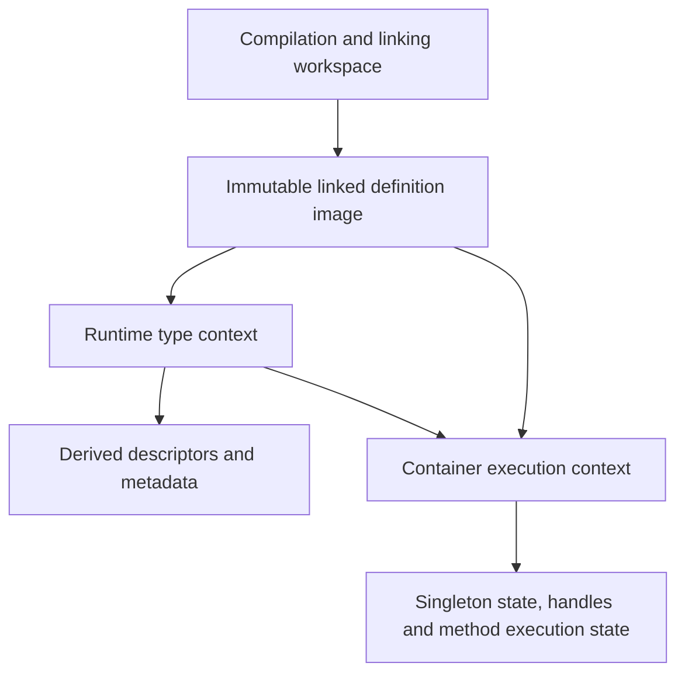

# Separating definitions, type metadata and execution state

Status: proposal for discussion, 2026-09-24. No architectural split is implemented by this
branch. The correctness baseline is `lagergren/constant-pool-ownership-only`, extracted from
master `601a68e8b` with prerequisite `d8c6c3176` and ownership commit `65e5ce149`;
[the ownership audit](constant-pool-ownership.md) documents its changes,
regressions and remaining limits. The original embedding/Gradle/shutdown work remains on
`lagergren/constant-pool-ownership`. JIT development remains separate.

## Recommendation and decision boundary

A separation is plausible and would make ownership easier to explain. Start by moving singleton
execution state out of definition constants, in a separate commit/PR after the correctness
baseline. Measure that limited prototype before committing to a fully frozen runtime image.
Do not combine the full architecture migration with this extraction.

The full split is substantial: factories, reflection, method execution, native bootstrap and
metadata queries currently use the same object graph. Moving a few cache fields does not freeze
that graph, and freezing it immediately would break legitimate runtime type construction.
The stages below are independently reviewable hypotheses, not a commitment to implement them.

The existing ownership fixes remain necessary during migration. A destination must still be
explicit, and sharing a definition must still be distinguished from sharing a live value.
Freezing definitions removes some opportunities for accidental mutation; it does not decide
module compatibility, application isolation, diagnostic routing or synchronization for us.

## Why an immutable type system still has mutable pools

The [language design](x.md) says that a container's activated type system is immutable. That
constrains its declarations and relationships. It does not require every possible parameterized,
union, intersection or annotated type descriptor to have been materialized in advance.
Reflection can describe combinations of already-defined types without adding a declaration.

Today's implementation combines several distinct responsibilities:

| Responsibility | Current examples | Is it a disposable cache? |
|---|---|---|
| Compiled definitions and serialized constant indices | `FileStructure`, `Component`, `ConstantPool`, method code | No: these define the program and interpret its binary references |
| Canonical descriptors constructed on demand | `ensureParameterizedTypeConstant`, other pool factories | Not generally: canonical identity and indexing may be relied upon |
| Derived semantic metadata | `TypeInfo`, relation/variance/member maps on `TypeConstant` and related constants | Potentially, only if all inputs and diagnostic results are preserved |
| Native/runtime representations | templates, `ClassComposition`, reflective type handles | Context dependent; cannot assume portability between runtimes |
| Live execution state | singleton handles/waiters, method initialization, runtime annotation captures | No: clearing it can change observable behavior |
| Compiler working state | unresolved types, registers, validation recursion and diagnostics | Mutable, scoped to compilation; not runtime image data |

The ownership difficulties arise at several levels, rather than from caching alone. The audited
bugs include writing a source during adoption, choosing the wrong construction destination,
copying compiler state, retaining a request listener, and looking up a singleton in the wrong
container. Caches amplify these problems when they retain objects from another owner.

## Alternatives and their cost

| Option | Benefit | Limitation |
|---|---|---|
| Keep the corrected ownership model | Lowest migration cost; explicit destinations and isolated copies already fix demonstrated defects | Definitions, caches and execution state remain mixed; copies and reset logic remain necessary |
| Move execution state to side tables first | Gives singleton lifetime a clear home; permits testing shared definitions without shared values | Pools still create descriptors and metadata; this does not freeze them |
| Split linked images, descriptors, metadata and execution | Strongest structural boundary; may enable safe reuse and remove copies | Broad migration with native bootstrap, reflection and indexing consequences |
| Precompute every runtime type and freeze today's pool as-is | Superficially avoids a new descriptor layer | Not a general solution: runtime combinations and captured annotation values need on-demand representation |

The staged recommendation starts with the second option. Its results determine whether the
third option is worth pursuing. Keeping the corrected current model is a valid stopping point.

## Proposed boundaries

These are conceptual names, not a proposed final Java API.

### 1. Compilation and linking workspace

Keep mutable construction, unresolved constants, validation attempts, register allocation and
linking here. `FileStructure` and existing builders can initially keep their compiler APIs.
An explicit finalization step produces a complete linked image after validating references.
Compilation still owns a non-null request listener; no immutable image retains that listener.

A compiler may discard or rebuild metadata as declarations change. That invalidation protocol
must remain distinct from memoization over a frozen runtime image. This design does not enable
parallel use of a mutable compiler or imply that its current structures are thread safe.

### 2. Immutable linked definition image

Own fixed declarations, method definitions, literal constants and the mapping from serialized
constant indices to definitions. References into another image carry an explicit image identity
and are resolved against a fixed dependency graph. Initially, identity can be an opaque token
per prepared image; do not invent a global content-addressed registry before it is needed.

Keep the XTC binary format unchanged in the first stages. Serialized indices remain local to
their image. Runtime-created descriptors must use a distinct reference domain, not silently
append to a serialized table or masquerade as a portable constant index. Audit `getPosition()`
consumers, frame constant arrays, relocation and switch dispatch before enforcing this boundary.

An image is publishable only after linking and structural native preparation have completed.
The image exposes read operations; attempts to register new definitions after publication fail
at the mutation boundary. A read that lazily decodes a body needs either a safely published,
immutable decoded value in a side table or eager decoding. It must not expose compiler-owned
mutable Ops or ASTs to several executions.

### 3. Runtime type context and derived metadata

Own an interner for immutable descriptors over a fixed image/dependency graph, plus separate
memo tables for derived facts. Runtime reflection asks this context to parameterize, combine or
annotate a type. A declaration can remain frozen while these descriptor tables grow.

Interning is not ordinary memoization: arbitrary eviction may break identity assumptions.
Its lifetime and growth need measurement and an explicit owner. A disposable relation cache
may be cleared only if recomputation has identical results, including diagnostic replay.
Neither table should retain a request listener, container service or captured object handle.

Query keys need every semantic input: image/generation identity, operands, type arguments and
any applicable access or resolution context. Native bindings belong in the key/context if they
affect the answer. Names alone are insufficient when a module is recompiled under the same name.
Start with context-local caches; sharing across contexts is a later optimization requiring proof.

Recursive calculations need calculation-local in-progress state and clear failure semantics.
Do not copy recursion guards or expose a partially calculated entry as a finished answer.
Immutable completed results can be published safely; synchronization and reentrancy still need
explicit design even when source definitions are immutable.

Diagnostics stored with metadata are immutable result values, replayed to the current request's
listener. Audit their payloads for retained AST/source/structure references before sharing them
across image lifetimes. Removing the listener reference alone does not establish bounded retention.

### 4. Container execution context

Own the live state associated with executing definitions: singleton values and initialization
coordination, reflective handles, native/template bindings, class compositions, and method
initialization state. Some representations may later prove shareable within a runtime; their
initial placement should reflect the narrowest proven lifetime.

The singleton lookup is conceptually:

1. Resolve the definition in the requesting container's type context.
2. Select the permitted value owner using explicit module-sharing ancestry.
3. Canonicalize the definition key in that owner's context.
4. Obtain or initialize the value in that owner's execution state.
5. Publish success or release failed initialization and notify waiters there.

Shared primitive/core values can belong to the native root. Unshared application singleton
state belongs to each application or nested container. Two containers reading the same image
do not automatically share a service, singleton constructor result or mutable handle.

Definition-sharing and value-sharing policies must be independent and visible in APIs. Type
compatibility does not grant authority to reuse a live object. Existing `getOriginContainer`
behavior is the starting contract, not an excuse to broaden sharing to every equal module name.

Execution-owned state is released with its existing owner. This plan does not implement socket,
watcher, timer or HTTP shutdown. Those mechanisms remain a separate part of the embedding series.
It must integrate with them later without forcing shutdown changes into this correctness branch.

## Source areas that constrain the design

| Area | Current behavior to preserve or separate | Likely first change |
|---|---|---|
| `ConstantPool`, `Constant.registerConstants`, `TypeConstant.registerConstants` | Adoption, canonicalization and definition ownership are combined | Separate read/resolve from destination construction; retain explicit destination adapters |
| `FileStructure` copy/merge/link, `MethodStructure.cloneBody` | Prepared structures are copied to isolate caches, code and execution state | Classify each copied field before eliminating copies |
| `SingletonConstant`, `ConstHeap`, `Container`, `Utils` | Constant objects hold handles/waiters; owner dispatch is necessary | Move initialization state to an owner-local table keyed by canonical definition |
| `TypeConstant`, `TypeInfo`, parameterized/signature/property constants | Semantic caches and recursion state live beside definitions | Move one proven-pure calculation at a time into the type context |
| `MethodStructure`, `Frame`, service-local operation caches | Method initialization and decoded code have different lifetimes | Separate execution flags from immutable method body data; retain service-local runtime caches |
| `ClassTemplate`, `NativeContainer` | `markNativeMethod` / `markNativeProperty` can synthesize structural overrides | Finish structural preparation before freeze, or design an explicit native binding overlay |
| `xRTType`, `xRTTypeTemplate` | Reflection constructs descriptors and handles on demand | Route descriptors through the type context, handles through the execution context |
| `HandleConstant`, annotated types | Runtime annotation arguments can capture actual handles | Keep captures in an execution-owned representation; never put them in a globally shareable type key |
| Native template static `INSTANCE` and cached types/handles | Some state is classloader-wide today | Audit cross-runtime assumptions before publishing reusable images; do not call this solved |
| `Reporting`, `TypeInfo` diagnostics | Metadata must not capture request sinks | Preserve request replay; inventory payload retention before broad cache sharing |

A compatibility facade can temporarily keep familiar methods, but it must require the relevant
context at construction/runtime boundaries. For example, a definition owner accessor remains a
read operation; `typeContext.parameterize(definition, arguments)` expresses construction;
`executionContext.singleton(definition)` expresses live-value access. Do not replace the old
ambient thread-local pool with an ambient thread-local type context under a new name.

Cross-image operations also remain explicit. A library definition may be read from image A while
a specialized descriptor is needed in context B. Either B can reference A through its dependency
graph or the operation must reject/translate that reference. Equal names do not establish equal
generations. Values capturing a container require additional lifetime checks even when their
underlying type definitions are compatible.

## Reviewable implementation sequence

| Stage | Scope and deliverable | Deliberately excluded | Evidence needed to proceed |
|---|---|---|---|
| 0. Correctness baseline | This extraction and ownership audit | Architectural implementation, Gradle modes, new JIT work | Independent unit and XDK integration passes |
| 1. Mutation inventory | Classify writes after activation; optional counters for registrations, copies and cache misses | Freeze enforcement or broad cache rewrite | Reproducible report naming mutation sites and lifetimes |
| 2. Singleton prototype | Owner-local initialization table; migrate handles, waiting and failure release together; narrow adapter for existing callers | TypeInfo/interner rewrite, native resource shutdown | Existing singleton regressions plus same-image isolation/sharing tests |
| 3. Descriptor boundary | Runtime descriptor interner distinct from compiled constant indices; explicit resolution context | Global interning, binary format changes | Reflection, cross-image resolution and index-domain tests |
| 4. Metadata separation | Move selected derived metadata and diagnostics to context-owned memo tables; later separate remaining runtime handles/method flags | Assuming every TypeInfo is context-free | Cache-clear equivalence, recursion/failure and generation-isolation tests |
| 5. Frozen image | Complete native preparation; prohibit definition writes; immutable body publication | New container models or cross-build reuse | Full interpreter regressions with freeze guards enabled |
| 6. Optional sharing | Reuse proven immutable images/metadata across requests with measured retention policy | Cross-generation name-based cache, arbitrary interner eviction | CPU/allocation/retained-memory comparison and ownership assertions |

Each row is a scope boundary, not necessarily a single small PR. Stages 3–5 may need further
splits after stage 1's inventory; do not assign reliable effort estimates without that evidence.
The singleton prototype is the smallest useful architectural experiment, but even it must migrate
all initialization/failure paths rather than just moving the handle field.

Stages 2 and 4 should keep definitions usable by existing code through narrow transitional APIs.
Every intermediate commit must compile both interpreter and the existing shared JIT sources.
New JIT runtime behavior and its validation belong on the `JIT` branch; coordinate shared API
changes there rather than importing the archived embedding JIT implementation here.

## Validation plan

The current tests establish a correctness baseline, not proof of the proposed design. Add the
following with their corresponding stages; use assertions and deterministic barriers, with
bounded waits only as hang guards:

- Run two applications against the same image: unshared services/singletons stay independent;
  explicitly shared ancestors and native primitives preserve their expected identity.
- Exercise sibling and grandchild containers, singleton switch lookup, failed initialization,
  retry and multiple waiters. Coordinate concurrent waiters explicitly, without sleeps.
- Query with no ambient pool and with an unrelated ambient pool; verify both source integrity
  and destination identity. Dispatch work to another thread with its explicit context.
- Build derived descriptors after activation while asserting no definition-image mutation and
  stable serialized indices. Reject writes at every public structural mutation entry point.
- Run the same metadata query cold, warm and after clearing only disposable memo tables;
  require equivalent results and diagnostics for each request.
- Recompile a module under the same name with changed declarations; verify the old and new
  image contexts never reuse incompatible descriptors or metadata.
- Force recursive-query failure and retry; verify partial results and in-progress guards are
  not published as completed entries. Test synchronized canonicalization with barriers.
- Exercise runtime annotations that capture values: they must remain in the capturing execution
  context or follow a deliberately defined transfer rule, never become globally shared literals.
- Check every removed copy/reset against its former isolation purpose. A passing simple type
  comparison does not validate method initialization, handle retention or register ownership.

Keep distribution-dependent `.x` tests under the XDK test task with declared build prerequisites;
unit tests construct their own metadata. Do not add an automatic all-execution-modes or broad
JIT CI matrix for this work. Measure retention separately from correctness assertions; forced-GC
timing is not a deterministic unit-test oracle.

## Performance experiment and stop conditions

Use the same interpreter workload and build inputs for baseline and each prototype. Record cold
preparation, repeated preparation/execution, CPU stacks, allocation and retained heap. Separate
module copying/linking, type metadata construction, singleton initialization and program work.
An explicitly requested benchmark may disable task caching to ensure execution; normal build
behavior and CI configuration stay unchanged.

The potential win is avoiding repeated copying/rebuilding of proven immutable data. The costs
are extra context/table lookups, retained canonical descriptors, synchronization, and migration
complexity. No speedup is assumed, and this document adds no heap/metaspace flags.

Set acceptable performance and memory budgets after recording a baseline. Stop or revise a
stage if it cannot preserve identity/isolation, if cache keys need unbounded hidden context,
if retained state crosses its owner's lifetime, or if the measured benefit does not justify
additional indirection and maintenance. Structural clarity can justify a small change on its
own; a wholesale rewrite needs stronger evidence.

## Decisions for the next discussion

1. Approve only mutation inventory and the singleton prototype first, or defer implementation?
   Recommendation: those two bounded steps, keeping this extraction independently reviewable.
2. Should compiled definitions remain represented by existing ASM classes behind a read-only
   facade, or become a new immutable representation? Start with the facade and guarded writes;
   decide after inventory whether its invariants are enforceable without pervasive exceptions.
3. Which metadata is genuinely image-pure? Establish this per calculation before sharing it.
4. Which native values are intentionally root-wide, runtime-wide or classloader-wide? Record
   that policy explicitly before supporting several reusable images/runtimes in one host.

A successful first prototype would make the singleton definition describe a singleton, while
its selected container owns the running instance and initialization state. That is a useful,
reviewable boundary even if we decide not to undertake the larger frozen-image architecture.
