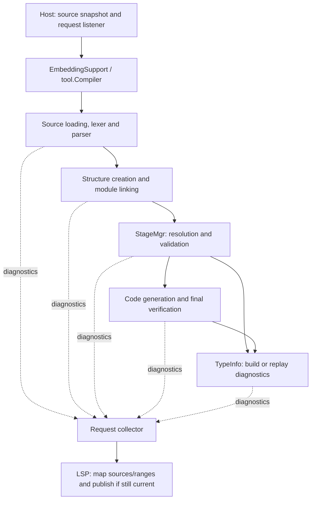

# Error listeners in the compiler and embedding API

This document explains why the `lagergren/errs` branch changes reporting throughout the compiler,
and which changes an LSP host actually needs. It describes the implementation as of 2026-09-22,
including module sessions, cross-file navigation, type hierarchy and Java parser recovery.
The chronological investigation is in
[errs.md](errs.md); the [integration plan](errs-integration-plan.md) records verification and
eventual PR boundaries.

## The problem the branch solves

An editor needs structured diagnostics from the compilation it requested: the source, range,
severity, code and message. It also needs to abandon obsolete work and distinguish invalid source
from a compiler failure. A CLI's printed output and final exit code cannot supply that contract.

The compiler already accepted listeners in many places. The problem was that the listener supplied
by the caller did not consistently determine where diagnostics went or how compilation continued.
Some paths substituted a silent listener, some looked up a listener through shared structures and
the ambient constant pool, and some assumed the listener was an `ErrorList`. Speculative work and
cached TypeInfo added two more ways for a diagnostic to disappear before reaching the caller.

Putting a callback on `EmbeddingSupport` alone could not fix this. By then, a lost diagnostic had
already been discarded, or a stage had stopped early. The changes therefore follow the operations
that produce, buffer, suppress and replay diagnostics.

There are three kinds of change in this branch:

| Kind | Examples | Relationship to LSP |
|---|---|---|
| Correctness fixes | Lost diagnostics, branch defaults, parser speculation, TypeInfo replay, repository failure propagation | Needed for reliable host reporting; useful to other compiler consumers too. |
| Explicit contracts and API cleanup | Non-null listener boundaries, named silence, scoped destinations, `void log`, reporting helpers | Make the behavior consistent and reviewable. Some choices are breaking API changes; LSP itself does not inherently require a particular Java method spelling. |
| Host integration | Named source, partial compilation results, cancellation, document versions and publication | Connect the compiler's reporting contract to an editor's lifecycle. |

## The reporting contract

The contract is implemented in [ErrorListener](../javatools/src/main/java/org/xvm/asm/ErrorListener.java)
and [ErrorList](../javatools/src/main/java/org/xvm/asm/ErrorList.java).

### Recording and stopping are separate operations

Previously, `boolean log(...)` combined recording a diagnostic with a decision about stopping.
`RUNTIME` could also throw from inside reporting. That made compiler control flow depend on the
listener implementation: a collector, observer or forwarding wrapper needed to reproduce more
than a reporting callback to behave correctly.

Now `log(ErrorInfo)` returns `void`. The compiler asks `isAbortDesired()` at its control-flow
boundaries and `hasSeriousErrors()` before proceeding where errors invalidate later work.
`hasError(code)` answers whether a particular diagnostic has been seen. The core collectors and
runtime listener record fatal/abort state instead of throwing inside `log`. The CLI launcher retains
its immediate FATAL exception policy; it must forward the structured diagnostic to its host before
that exception. A host must not have to infer an error solely from the exception text.

This is an intentional API break, not an unavoidable requirement of the LSP protocol. An adapter
around the old API could have preserved its signature, but this branch chooses to repair the
contract and migrate its callers. Java cannot retain both forms as overloads differing only in
return type. External implementations must migrate and recompile.

A bare lambda implements only `log`; the interface's default state queries still answer as though
nothing happened. Hosts should use `ErrorListener.collecting(sink)` for forwarding with diagnostic
state, or `ErrorList` for collection, deduplication and a finite error budget. `collecting` does not
deduplicate. `tee` forwards reports to both listeners and combines their state queries, allowing
TypeInfo construction to report and record the same diagnostic.

### Branching must work with a host's listener

The old default `branch(node)` imposed a one-error budget. Method validation through such a branch
could stop after its first error for a custom host listener, even though an `ErrorList` consumer
would see more diagnostics. The old default `merge()` also threw on an unbranched listener.

The new default branch has no independent finite budget. An `ErrorList` branch inherits its
parent's configured budget, and branches also observe the parent's abort request. Merging an
ordinary sink is a no-op. A branch buffers its diagnostics until explicitly merged; discarding a
branch discards its speculative reports. A node-associated branch can give a structure diagnostic
the source location known by the validating AST node.

Named budgets make the intended policy visible: `DEFAULT_MAX_ERRORS` is 100, `FIRST_ERROR` is one,
and `UNLIMITED` has no finite error limit. Fatal diagnostics still request an abort. These are
collector policies; they do not promise that every invalid source can be validated to completion.

### Silence must have a reason

Replacing null with a blackhole made an omitted listener indistinguishable from an intentional
probe. Reporting boundaries now require the listener, and compiler operations either propagate it
or explicitly choose silence:

| Reason | Meaning |
|---|---|
| `PROBE` | A candidate is being tested. Failure is the answer to the test, not an error in the user's selected program. |
| `CASCADE` | Work is examining an incomplete result; further errors may only be consequences of the original problem. |
| `DISCARD` | The caller deliberately does not want reports from this operation. |

The reasons document intent; they are not different validation algorithms. A derived
`errs.silence(reason)` retains its original listener and observes its abort request. It does not
retain discarded messages. TypeInfo's separate recorder, described below, is what preserves
diagnostics produced while building cached type information.

Non-null reporting is an active-operation contract. It is not a claim that every field everywhere
is non-null: for example, a resolver's scoped destination is inactive between resolution calls.

## Why the compilation pipeline had to change

The embedding path uses the existing compiler phases. It supplies sources and repositories, keeps
the artifacts produced by the attempt, and reports through the caller's listener.



The arrows show reporting ownership, not a requirement that every operation use the same listener
object. Branches, scoped destinations and temporary collectors remain necessary, but their
forwarding or suppression is explicit.

### 1. Source loading and parsing

`Source(text, name)` gives unsaved text an identity. Two documents with the same error at the same
offset must not collapse into one diagnostic. The existing string entry point remains a
convenience; callers with document identities use the `Source` entry point.

The parser previously had its own speculative-reporting mechanism. A successful speculative parse
could lose warnings because keeping its tokens did not keep every diagnostic. `Parser.Attempt`
now uses a listener branch: keeping the parse merges its reports; rollback restores the tokens
and discards them. Parser lookahead and resolver callbacks use a
[Reporting](../javatools/src/main/java/org/xvm/asm/Reporting.java) scope so exceptional exits restore
the prior destination. The module-name scan no longer replaces the parser's listener field.

Declaration and statement loops now use the parser's recovery helpers. A malformed statement can
be omitted while its enclosing method and following declarations survive; missing braces report
EOF while retaining completed headers. Recovery is disabled inside speculation and stops for a
host abort or exhausted error budget. The parser does not invent an expression to validate later.

The new `compileModule(ModuleInfo, ...)` overload also uses CLI source discovery and parse-tree
assembly. `ModuleInfo.Node` buffers reports and forwards them after source-tree stages. A fresh
`ModuleInfo` is required for each attempt because it caches parsed input. Its `readSource(File)`
hook substitutes unsaved content, while `sourceEntries(File)` supplies source/directory membership,
including new unsaved members. The default hooks keep disk-based CLI behavior. Single-source and
source-tree inputs then enter the same compiler pipeline.

In `lang`, `XdkSources` captures one attempt's source text and membership, applies editor overlays
and maps canonical paths back to editor URIs. This is the input to the module session described
below. Source and resource paths retain their original filesystem context; unsaved resource assets
are outside the overlay contract. `ModuleInfo.Node.parse(errs)` passes host cancellation into member
parsers through their local diagnostic collectors. Cancellation without an error must not trigger
the fallback parse-failed FATAL diagnostic.

### 2. Structure creation and linking

The old low-level compiler parked a file structure's listener on `BLACKHOLE` during compilation.
`XvmStructure` and `FileStructure` also offered ambient lookup and setters, including a setter that
could redirect a parent tree's reporting. Consequently, a TypeInfo query could report through a
shared file or the current thread's pool instead of the operation that requested it.

The branch removes that structure-owned listener path. Callers pass the listener explicitly into
reporting operations, including TypeInfo construction. Intermediate branch commits introduced a
temporary `FileStructure.reportingTo` scope, but that API is absent from the final design and
should not be reintroduced when extracting PRs.

Repository failures needed a separate fix. File and directory repositories caught read failures,
printed them and returned no module. This erased the cause and could put ordinary text on a stdio
LSP protocol stream. They now propagate I/O failures with their path and cause; failed reads are
not cached as successful absence. The embedding boundary converts these failures to a structured
`EMB-5` diagnostic. Corrupt dependencies are therefore visible failures rather than silent misses.

### 3. Resolution and validation

[StageMgr](../javatools/src/main/java/org/xvm/compiler/ast/StageMgr.java) retains the supplied
listener and passes it into AST stage operations. Resolution collectors must expose their reporting
destination instead of inheriting an implicit silent default. These changes prevent an AST
validation error from losing the request's listener halfway through the call chain.

Loops and `try`/`finally` validation previously used nullable listener fields partly as flags for
whether validation was active. `ValidationScope` groups that context and listener so an inactive
operation is distinct from an active operation with a missing listener. This belongs in compiler
validation: it is the compiler that knows when lazily created variables and nested validation must
use that context. The LSP adapter cannot reconstruct it afterward.

Similarly, fit checks and candidate searches belong in AST/compiler code because that code knows
whether a candidate was selected. Making every probe report would turn valid source into a list
of rejected overloads and incomplete-type errors. The required change is explicit ownership and
intent at each call site, not an indiscriminate replacement of silent listeners.

### 4. TypeInfo construction and cache hits

A TypeInfo can first be built by a silent probe and then reused by real validation. Passing a
listener only when building the value is insufficient: the second caller gets a cached value and
would otherwise hear nothing about its construction.

`TypeConstant.ensureTypeInfo(errs)` records construction diagnostics while forwarding them to its
caller. It stores an immutable diagnostic list and replays that list on a current, complete cache
hit. It does not retain the caller's listener in the cache. The no-argument convenience remains a
quiet query; a caller responsible for reporting a selected source use must pass its listener.

A concrete lost-warning case is:

```xtc
module M {
    class Base    { @Atomic Int x = 1; }
    class Derived extends Base { @Atomic @Override Int x = 2; }
}
```

The earlier investigation reproduced a silent successful compilation on master even though the
compiler detected the redundant annotation. The branch reports `WARNING VERIFY-75`. This is a
visible bug fix: programs that compiled quietly can now emit a warning without becoming invalid.

Warning-only TypeInfo builds can be cached, so replay matters. A build with serious errors does
not cache its completed TypeInfo in the same way; a later caller may rebuild and report again.
Tests distinguish these cases and also cover generic consumers of serialized dependencies.

Replay can reach the same request more than once. `ErrorList` suppresses repeated identities;
a raw listener or `collecting` callback may receive duplicates. Each compilation attempt should
have its own collector. The current `VERIFY` identity deliberately omits source location, so the
deduplication policy is not universally one diagnostic per source range.

### 5. Code generation and final verification

Reporting continues through generation and final file validation; it cannot end at the parser or
at name resolution. Some nested compiler work performs validation while the outer phase is called
code generation. Classifying a diagnostic by the outer stage name alone can therefore mistake
provisional composition for final verification.

The CLI still drains actual `ErrorList` instances at stage boundaries. Streaming embedding reports
take the direct `Launcher.log(ErrorInfo)` path to its final host delegate. The branch does not
remove every `instanceof ErrorList`; the important requirement is that a non-`ErrorList` host has
a working reporting path and does not depend on being drained as a list.

The module-session tests found a further loss at that forwarding boundary. Renaming a superclass
in the root left a member extending the missing name. `Launcher.log(ErrorInfo)` attempted console
reporting before notifying its delegate; console FATAL handling threw, so the original `COMPILER-30`
never reached the host. The embedding catch then synthesized `EMB-5` on the root. Forwarding now
precedes console reporting. The host receives the original member diagnostic, and the expected
launcher abort remains an abort with a known diagnostic.

### 6. Completion, cancellation and failure handling

[EmbeddingSupport](../javatools/src/main/java/org/xvm/api/EmbeddingSupport.java) returns a
`Compilation` containing whatever was produced: a successful module, a file structure and its
pool, and a parsed AST when available. Failure no longer discards every artifact by returning only
null. `sourceTrees()` retains available per-file syntax, including recovery results. `parsed()`
remains absent after parsing/loading errors, so a member parse failure cannot feed an incomplete
module into semantic compilation. Structural queries can use the retained source trees; semantic
queries remain unavailable until the whole module parses. These artifacts are partial compiler
state, not a promise of valid semantic facts after any error.

The single-source path initially passed the launcher's abort policy directly to Parser. The
launcher stops compilation on an ordinary error, so that path could not finish recovery even when
the host's budget allowed it. Parsing now uses a stage-local stateful collector that forwards to
the launcher and observes the host's abort request. The launcher still stops subsequent semantic
stages. This distinguishes recovery within a stage from permission to compile the recovered tree.

The separate `analyzeIncomplete(Source, ...)` entry point permits one explicitly recognized
incomplete statement at EOF to enter partial analysis. Parsing reports to a stateful host collector
immediately; any other serious parse/lexer error prevents semantic work. The compiler starts with
its own stage state, validates intact receiver/argument children in the real method context, and
then encounters the retained EOF boundary during statement validation. That failure stops emission
of the damaged method. Earlier valid methods may have been processed; `PartialAnalysis` exposes
no module or file artifact and makes no successful-compilation claim.

The EOF diagnostic is replayed to stop the compiler internally but deduplicated before the host
callback, including for a bare non-deduplicating host. Cancellation and budgets remain shared across
both phases. EmbeddingCompiler's abort predicate also checks the host between phases so cancellation
cannot advance an unfinished compiler into its next stage. A corrupt-repository regression proves
that an unexpected failure remains visible even after the source EOF diagnostic.

That distinction exposed a pre-existing lexer loop on unterminated strings: repeated identical
reports were deduplicated, leaving the error budget unchanged and the lexer spinning at EOF.
The lexer now reports the missing terminator once and exits that token scan. Recovery tests cover
ordinary/template strings with an unlimited collector and fail on a repeated report.

`ErrorListener.cancellable(errs, cancelled)` combines a host cancellation request with the
listener's normal abort policy. Branching and merging preserve the wrapper. Already-cancelled
embedding work does not parse; cancellation alone does not invent a source error.

Expected `LauncherException` aborts with diagnostics or cancellation do not generate an additional
internal-error diagnostic. Unexpected runtime exceptions and assertion failures do, even if a
source error was reported first. Otherwise, a real compiler defect could hide behind the first
ordinary error in an editor buffer.

Cancellation is cooperative, not preemptive. The source snapshot checks it while enumerating and
reading files; member parsers observe it through their local collectors. Lexer now polls at the
start of every token, including valid tokens: previously its reporting path could notice abort,
but a long valid token stream did not have to report anything. A deterministic regression cancels
while reading a large valid source and verifies prompt termination with no diagnostic or AST.
Module tests also cover cancellation during member loading and supersession by a sibling edit.
There is no latency guarantee inside one long token, blocking I/O or a compiler stage without a
checkpoint.

## Diagnostic identity, locations and LSP publication

The old diagnostic UID omitted end positions and reduced message arguments to a hash. Distinct
diagnostics could collide and disappear from an `ErrorList`. The branch includes the complete
span for non-`VERIFY` source diagnostics and the rendered arguments rather than their 32-bit hash.
Named in-memory sources distinguish documents. Tests pin both span differences and known hash
collisions. This improves the existing UID scheme; it is not a new universal structural identity.

`Site.In`, `Site.At` and `NOWHERE`, plus `error`, `warn`, `info` and `fatal`, express the available
location without a hand-built argument array. They simplify reporting; they do not manufacture
a precise source location for a structure that never had one. The old array-shaped overloads
remain deprecated. Diagnostic origin metadata helps trace reporting without affecting identity.

The [XdkAdapter](../lang/lsp-server/src/main/kotlin/org/xvm/lsp/adapter/xdk/XdkAdapter.kt) converts
compiler diagnostics into editor data and owns one analysis per module scope. An edit invalidates
all of that module's views; only its current request may install the replacement. The server
publishes diagnostics at each member's URI with that open document's version, including unchanged
siblings reanalysed because of the edit. Closed members receive unversioned diagnostics. Removed
members are cleared; closing an overlay restores disk input and refreshes surviving open siblings.
Closing the last open document releases the module analysis and clears its publications.

Diagnostics outside the captured source set remain related information on the requesting document;
they are not evidence that the server owns that dependency's source. These versioning, stale-result
rejection and publication policies belong in `lang`, not in compiler listeners or AST nodes. A
compiler listener cannot know whether the user has typed again unless the host supplies that
information.

The semantic source bindings added to AST nodes serve hover and navigation. They are a separate
concern from diagnostic delivery; their rationale and ownership are documented in the
[AST inventory](errs.md#ast-changes-for-embedding-and-lsp-ownership-and-placement). Semantic copying
and LSP models live in the existing Kotlin LSP module, with no Kotlin dependency in javatools.

Selected-call records now travel through a separate attempt-owned collector passed through compiler
stages and validation contexts. ErrorListener is not used as a semantic event bus. The explicit
partial-member copier can request receiver TypeInfo on the compiler worker; that operation creates
a local stateful reporting listener, forwards diagnostics and host cancellation, and suppresses
candidate output after inspection errors. Ordinary copied-snapshot queries remain compiler-free.

Implementation lookup follows the same reporting boundary. The additive Kotlin
`semanticSnapshots(errors)` overload inspects source TypeInfo and copies nominal ancestry and
method-chain declaration identities on the compiler worker. The no-argument overload remains
passive. Inspection errors reach the compilation's host collector; serious errors or cancellation
discard the implementation edges. Unadopted mixins are skipped because an `into` constraint is not
an implementing host. Type-definition links need only existing type identities and source
declarations, with no new compiler listener path or AST state. Both editor queries use copied facts.

The dependency host API preserves this boundary. Each compilation/cursor attempt opens a fresh
repository from immutable `XdkDependency` artifacts and uses the existing host listener and
cancellation path. A successful compilation can export detached declaration locations with
`toDependency()`; a failed compilation cannot export a dependency. Replacing the complete artifact
set invalidates affected consumers and pending probes. The server performs replacement and
diagnostic refresh under its publication lock, retaining current document versions. No dependency
state is carried by ErrorListener and no new AST fields are required. Artifact/source revisions
belong to the host; binary-only inputs have no invented source targets.

Explicit source graphs now add automatic dependency builds. Each module attempt still uses its own
ordinary compiler listener with host cancellation. Dependency diagnostics retain their original
source locations; the server publishes them at each open source's current version. A failed source
dependency blocks consumers with host diagnostic `DEPENDENCY-FAILED` instead of supplying an older
artifact. Missing/unreadable roots report `SOURCE-UNAVAILABLE`; configured/declared name mismatches
report `PROJECT-MODULE`. These are host configuration/input failures, not synthesized compiler
internal errors. Debouncing and reverse invalidation live in Kotlin and add no listener/AST state.

## Ambient constant pools: pre-existing defects versus branch changes

Constant-pool ownership and error-listener ownership are related historically, but they are
different mechanisms. The listener lookup has been removed; the ambient constant pool remains.

The following provenance was checked against local git history, using `4a1eae6f7`, the merge base
with the local `origin/master` reference. This does not claim to check the latest remote master.

| Change | Provenance and scope |
|---|---|
| `FileStructure.getErrorListener()` null-pool crash | A pre-existing defect already fixed on master by `5effa757d` on 2026-08-31 (#548). Both the original documented baseline `794bf23e6` and the current branch base include that guard. This branch later deletes the lookup in `0af497641`. |
| `MethodBody.pool()` and diagnostic formatting | The base returns `ConstantPool.getCurrentPool()` directly. The branch exposed the defect while formatting a TypeInfo assertion failure on a thread with no pool. `cae4f9452`, consolidated by `610873fb6`, supplies the body's owning pool as fallback. |
| The broader ambient-read guard in `610873fb6` | All 18 replaced read sites existed in the base: six ByteConstant, four IntConstant, two TypeConstant, and one each in ConstantPool, IdentityConstant, MethodBody, MethodInfo, PropertyInfo and InterpreterConnector. These are pre-existing assumptions being hardened, not 18 independently reproduced crashes. |
| Thread-local scope implementation | The branch does not change `getCurrentPool`, `setCurrentPool` or `withPool`. It does not repair a newly introduced ThreadLocal implementation or make shared compiler state concurrent. |

`ConstantPool.currentOr(fallback)` and `Constant.poolInUse()` prefer a bound pool and use the
object/container pool only when none is bound. This preserves existing cross-pool behavior during
compilation while allowing the guarded operations to run outside that scope. It does not establish
that every compiler operation can run on arbitrary threads or without an explicitly selected pool.

The branch's earlier prose incorrectly described the FileStructure crash as another new discovery
within this branch. Its original fix was already upstream; the separate removal of ambient
listener ownership is the relevant change here.

## Evidence and remaining work

These existing regressions exercise the contract at different boundaries:

| Boundary | Regression coverage |
|---|---|
| Listener behavior | `ErrorListenerBranchTest`, `ErrorListenerAbortTest`, `ErrorListenerCancelTest`, `ErrorListenerSilenceTest`, `ErrorListenerSiteTest`, `ErrorDeduplicationTest`. |
| Parser and compiler | `ParserAttemptTest`, `ParserRecoveryTest`, `CompilerDiagnosticsTest`, `ConstantPoolDiagnosticsTest`. |
| Repository and embedding failures | `FileRepositoryFailureTest`, `DirRepositoryFailureTest`, `EmbeddingRepositoryFailureTest`, `EmbeddingDiagnosticsTest`, `LauncherErrorHandlingTest`. |
| TypeInfo reporting | `TypeInfoDiagnosticsTest`: real errors, the redundant-annotation warning, cached replay, generic instantiations and serialized dependencies. |
| Final TypeInfo compositions | `TypeInfoFinalCompositionTest`: fifteen freshly deserialized final compositions, selected substituted members/inherited chains, a fresh anonymous property, invalid-override controls and constant/runtime `@Parsed` metadata with invalid-argument controls. |
| Editor lifecycle | `XdkAdapterTest`, `XdkAdapterLifecycleTest` and packaged stdio tests. |
| Source-tree API probes | `CompilerProjectTest`: member overlays, source attribution, cancellation before work, failed parsing and shared per-source semantic identities. |
| Module sessions and publication | `XdkModuleSessionTest`, `XdkModuleServerTest` and `XdkStdioTest`: member overlays, invalidation, cancellation, per-file versions, file creation/removal, cross-file navigation and hierarchy round trips. |
| Partial source results | `XdkRecoveryTest` and packaged stdio: recovered syntax, sibling outlines, UTF-16/CRLF ranges, unavailable semantics after parse failure and restoration after correction. |
| Explicit incomplete analysis | `XdkPartialAnalysisTest`: real receiver/parameter identities, flow narrowing, argument spans, UTF-16/CRLF, no overload or emitted method, unsupported syntax, cancellation/budgets and exactly-once EOF delivery. |
| Cursor request consumers | `XdkCompletionSignatureTest`, `XdkCursorRequestTest`, `XdkCursorServerTest` and packaged stdio: copied completion/signature facts, cancellation propagation, module invalidation, unchanged diagnostics and rejection of late results even from an uncooperative backend. |
| Semantic consumers | `XdkSemanticLookupTest`, `XdkCallHierarchyTest` and `XdkPresentationTest`: type/implementation targets, selected source calls, resolved-name tokens, read/write highlights and bounded inlay hints. |
| Dependency host boundary | `XdkDependencyTest` and `XdkLanguageServerTest`: detached source indices, linked-pool metadata, source-less binaries, transitive invalidation, cancellation and diagnostic refresh at unchanged consumer versions. |
| Automatic source rebuilds | `XdkProjectTest` and `XdkProjectServerTest`: immutable source-closure capture, matching-artifact reuse, transitive changes, dependency failures/recovery, current diagnostic versions and cancellation of late work. |
| Ambient-pool fallback | `MethodBodyAmbientPoolTest`, `ConstantPoolAmbientTest`, including bound-pool precedence. |

The [integration record](errs-integration-plan.md) records compiler, LSP and packaged-stdio execution
and existing skips for each pass, including the latest dependency host API checks.
An extracted PR still needs its own tests and output-equivalence checks; green
tests on this integrated branch are not evidence that every proposed subset stands alone.

The [second local extraction batch](errs-integration-plan.md#second-local-extraction-batch-2026-09-24)
now records independent C1 evidence: executable migration examples, the full compiler test suite
and unchanged timestamp-normalized XDK output. C1 retains the legacy report/silence entry points
and null/ambient ownership while introducing the new reporting contract; C2–C4 migrate those
callers and owners separately. The extracted README explicitly documents the return-type break
and the requirement to recompile clients at a breaking release boundary.

The three follow-ups from the API probe pass are complete: permanent TypeInfo regressions, module
sessions and module-local cross-file navigation with direct extends/implements hierarchy. The
subsequent Java-only recovery pass supplies structural source trees after parse errors. Remaining work:

1. Widen the proven completion/signature consumer only with the corresponding compiler facts. In
   addition to its original trailing standalone statement, explicit cursors now cover module
   overlays, simple assignment/initializer values, single returns and final nested call arguments.
   It validates intact children in their compiler context, never the missing operation. Internal
   adapter cursor requests use the compiler worker and a cancellable listener, returning only
   copied facts and preserving normal diagnostics. Completion/signature protocol requests now
   propagate cancellation and reject facts after the document/module lifetime changes. Broader
   malformed expressions remain open. Scope completion, typed member prefixes and calls before
   existing closing parentheses now use the same explicit probe, with exactly-once diagnostics,
   cancellation and budget coverage; their results never replace normal compilation diagnostics.
   Compiler mode stays Java-only; stale semantic ranges must never stand in for current facts.
2. Add compiler facts only for a concrete consumer. Resolved-call signature help now consumes the
   actual instantiated signature and argument mapping. Incomplete calls now reuse compiler argument
   fitting on trial copies, with candidate-specific generic types and named mappings. Candidate
   mismatches are speculative and discarded; explicit TypeInfo inspection reports through the host
   listener and all probes observe cancellation. No candidate is a selected call. Method
   implementation lookup now copies actual override chains. Explicit dependency artifacts/source
   indices provide definition/type-definition and inherited-body links plus consumer invalidation.
   Explicit source roots/edges now support automatic dependency builds from edited sources.
   Initialization options and live editor settings now expose those source graphs; automatic project
   discovery and persistent cross-module indexing remain open. No new Java/AST hooks were needed.
   Bounded local/private-parameter rename now captures named labels and checks before/after bindings.
   Its two temporary compiler attempts use cancellable request listeners; rejected edits do not
   publish temporary diagnostics or change the live analysis. Wider rename remains unavailable.
   Hierarchy currently covers direct extends/implements edges between source types in the same
   compilation, not conditional mixins or external library sources.
3. The [bounded diagnostic audit](errs-audit.md#annotation-metadata-and-module-source-follow-up-2026-09-23)
   now covers `@Parsed`: runtime arguments exposed a false constructor error in reporting metadata,
   fixed without weakening actual annotation validation. A non-module root now reports positioned
   `EMB-6` instead of losing its console-only explanation and synthesizing `EMB-5`. Historical
   suppression counts are not an exhaustive proof; the bound-generic binary-AST TODO still needs a
   reproducer. Do not broaden reporting without evidence of a loss.

Tree-sitter remains the shipped default. The compiler adapter is opt-in and discovers conventional
module layouts. Its automatic dependency build loop needs host-supplied roots/edges; it does not
discover build-tool projects. Repository sharing still requires
serialized compilation. Scoped listener fields and immutable semantic snapshots reduce lifetime
problems but do not make the underlying compiler reentrant.

### Executable compatibility examples, 2026-09-23

The integrated API examples in
[`EmbeddingApiCompatibilityTest`](../javatools/src/test/java/org/xvm/api/EmbeddingApiCompatibilityTest.java)
exercise stateful `void` reporting with separate abort queries, non-null boundaries, retained
constructor signatures/current record patterns and the deprecated runtime-pool alias. The
[compatibility contract](errs-integration-plan.md#compatibility-and-migration-contract) explicitly
marks the listener return-type change and removed ambient API as breaking. Each extracted PR must
rerun its examples independently; these tests establish only the integrated branch's behavior.
