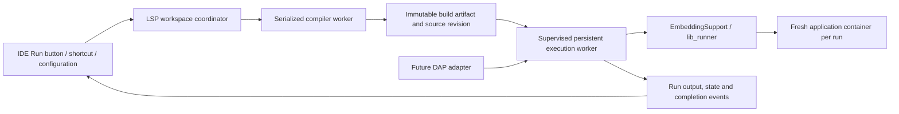

# Embedded compilation, Run and future debugging

Status: accepted architecture and delivery plan, 2026-09-28. The `errs` compiler/LSP work remains the current
implementation scope. This plan records the runtime contract it must accommodate; it does not
claim that embedded IDE Run or debugging is implemented. This investigation is based on source
inspection; runtime experiments and repeat-run acceptance remain R1 work.

## What the code already does

| Area | Evidence | Consequence |
|---|---|---|
| Compiler Run lens | [XdkAdapter](../../lsp-server/src/main/kotlin/org/xvm/lsp/adapter/xdk/XdkAdapter.kt) creates `xtc.runModule` for module symbols | A module declaration alone currently qualifies; this is not proof of a runnable entry point or a successful build |
| IntelliJ Run | [producer](../../intellij-plugin/src/main/kotlin/org/xtclang/idea/run/XtcRunConfigurationProducer.kt) uses a module-name regex; [configuration](../../intellij-plugin/src/main/kotlin/org/xtclang/idea/run/XtcRunConfiguration.kt) launches Gradle or `xtc` | Run shortcuts/configurations bypass the compiler session and unsaved artifact snapshot; the regex does not preserve qualified module names |
| VS Code Run | [command](../../vscode-extension/src/commands.ts) ignores the supplied source URI; [task provider](../../vscode-extension/src/task-provider.ts) builds shell command strings | Both clients need a common launch request, including source/workspace identity and argument arrays |
| Embedding execution | [EmbeddingSupport](../../../javatools/src/main/java/org/xvm/api/EmbeddingSupport.java) caches a connector and returns a `Control` per run | Reusable VM hosting is already the intended foundation; configuration is singleton and cannot be changed after startup |
| Interpreter control | [InterpreterControl](../../../javatools/src/main/java/org/xvm/api/InterpreterControl.java) loads the runner once, copies an artifact into its native container and invokes task registration/start | Compiler ASTs need not be retained for execution; startup currently also invokes runner `run`, starting its HTTP service |
| Runner | [runner.x](../../../lib_runner/src/main/x/runner.x) maintains task IDs and creates a fresh lightweight child container per task | Reuse the runtime/runner, while giving each normal rerun fresh application state. The Java embedding path should call task methods directly without starting HTTP |
| Current execution limits | Runner invokes `container.invoke("run", ())`; custom injections are rejected; [external console](../../../javatools/src/main/java/org/xvm/runtime/template/_native/io/xExternalConsole.java) cannot read input | Entry-point arguments, input, output channels, asynchronous completion/stop and bounded shutdown need an explicit host API |
| Existing repeat-run probe | [LspTest](../../../javatools/src/test/java/org/xvm/runtime/LspTest.java) exercises run, kill, filesystem, exceptions, repeated runs and native pool growth | This is a standalone main-based harness, not evidence supplied by an ordinary green JUnit task; promote meaningful checks into controlled regressions |
| JIT execution | [JitControl](../../../javatools/src/main/java/org/xvm/api/JitControl.java) is unsupported; embedding selects the interpreter | First delivery targets interpreter execution; do not advertise JIT parity |
| DAP | [XtcDebugServer](../../dap-server/src/main/kotlin/org/xvm/debug/XtcDebugServer.kt) logs requests, invents a thread and returns verified breakpoints without runtime installation | A transport stub is not debugging. Stop claiming verified breakpoints until a runtime bridge confirms them |
| Interpreter debugger | [Debugger](../../../javatools/src/main/java/org/xvm/runtime/Debugger.java) has frame/PC hooks; [ServiceContext](../../../javatools/src/main/java/org/xvm/runtime/ServiceContext.java) returns the global `DebugConsole.INSTANCE` | A real DAP bridge needs session-scoped debugger ownership and suspension/control APIs; parsing console output is not a suitable integration |

## Recommended ownership and process model

Use one compilation service contract and one execution service contract, shared by both IDEs and
the future DAP adapter. The service contract is independent of the transport and IDE UI.

Prefer a separate, lazily started execution-worker JVM per workspace/XDK configuration. Reuse it
across runs; do not launch a JVM, CLI or Gradle task for each ordinary editor Run. The coordinator
owns its process and connection. First implementation permits one active run per worker, with
explicit stop/restart behavior. Add concurrent sessions only after isolation and scheduling tests.

This is an architectural recommendation, not a claim that the existing runtime is unsafe in all
in-process hosts. An in-process prototype can prove the common API. For the shipped IDE, a separate
worker permits recovery from an unresponsive application, excessive native-pool growth or debugger
failure without losing compiler diagnostics. A lightweight child container is not an OS security
boundary. Existing compiler serialization remains intact; application execution never blocks the
compiler queue, JSON-RPC thread or IDE UI thread.

The worker uses the same pinned, full bundled XDK and version handshake as the compiler. A changed
XDK/injector/runtime configuration requires a new worker generation. Normal rerun creates a new
child container and uses the latest successful requested build. Running the exact previous artifact
is a separate explicit action. Hot reload into a live container is not implied by rerun.

Use a framed private control connection with separate application-output events. Do not let user
console output enter LSP/DAP framing. Stdio pipes are sufficient for an owned child; a local socket
for additional DAP clients needs scoped credentials and lifecycle ownership. No runner HTTP listener
is required for an IDE session. EOF, project close and parent death terminate owned work; cancellation
of one request must not accidentally abandon a process or terminate an unrelated run.

Keep the first coordinator implementation as a protocol-neutral Kotlin package in `lang`. A worker
entry point can be packaged with existing artifacts. Extract a small shared library only when the
LSP and DAP have actual shared code to consume; avoid creating several new Gradle modules now.
Java runtime/compiler contracts stay in javatools, without introducing Kotlin there.

## Build and launch contract

Names below describe proposed API roles, not existing public classes.

- `BuildRequest`: workspace/module identity, captured source versions, dependency/XDK revisions,
  compile options and cancellation. Run must compile the exact snapshot selected by the user,
  including unsaved buffers according to one documented policy in both clients.
- `BuildResult`: attributable diagnostics, success/failure/cancellation, source manifest and immutable
  emitted artifact/dependency closure. A last successful artifact is never silently substituted when
  the requested sources fail. A valid cache hit satisfies compile-before-run; a new compilation is
  not required when every relevant input is unchanged.
- `RunnableTarget`: compiler-proven module/entry-point identity, declaration location, accepted
  argument shape and build revision. XTC's default convention is `run`, not an assumed Java `main`.
  Align compiler inspection with the runtime's actual callable/default-argument rules. An arbitrary
  `.x` member file is not an independent program; resolve its owning module. Unsupported entry
  points produce a clear reason. Revalidate the target when launch begins.
- `RunRequest`: target/build handle, argument array, working-directory/resource policy, console/input
  channels, run mode and restart policy. Avoid nullable positional option lists and comma/shell parsing.
- `RunSession`: immutable ID and worker generation, observable state, asynchronous completion,
  result/exception, ordered output and stop/close operations. Distinguish queued, building, starting,
  running, stopping, exited, failed and cancelled. Publish exactly one terminal outcome. `Control`
  compatibility can be retained behind the richer asynchronous facade.

Use the existing [XdkDependency](../../lsp-server/src/main/kotlin/org/xvm/lsp/adapter/xdk/XdkDependency.kt)
artifact/revision/source-index ownership as the starting point. Extend it deliberately for an entire
build manifest and debugger source mapping. No compiler `ModuleStructure`, AST, TypeInfo, constant
pool or mutable repository crosses the worker boundary. Emit/copy bytes on the compiler worker;
open fresh runtime-owned structures in the execution worker. Runtime exceptions must be associated
with the launched artifact and source revision, not whatever buffer text happens to be current.

Incremental compilation is a future implementation behind `BuildRequest`, with explicit dependency
invalidation and cache keys. It does not require a different Run API. A current run pins its artifact
closure; editor changes affect the next build, not its running code or breakpoint source mapping.

Library/program entry-point distinctions should govern CodeLens, gutter buttons, context Run and
keyboard Run through the same target query. IntelliJ Run configurations retain user arguments and
working-directory choices; its Run console and Stop/Rerun actions wrap `RunSession`. Use Community
platform APIs and LSP4IJ only. VS Code uses the same requests and renders output through its task or
debug console. Neither client reconstructs the compiler invocation. Keep an explicitly selected
Gradle build/task path for generated inputs and user build automation; it is not the normal embedded
Run implementation. Build-model integration must supply those inputs before compilation.

First prove the service with embedded Run. A future DAP `launch` (including no-debug launch) uses
the same BuildResult and RunSession, then attaches runtime controls. The IDE transport may eventually
route both Run and Debug through DAP; that should not change compilation or execution ownership.

## Debugging boundary

Introduce a runtime debugger implementation behind the existing `Debugger` interface with explicit
session/container ownership. Define how fibers/services map to DAP threads, where they suspend,
which runtime thread may inspect frames, and how immutable stack/variable snapshots are obtained.
Support source/PC maps bound to artifact revisions; send unverified breakpoint reasons when a
location cannot be installed. Breakpoints must be installed before an initially suspended launch
resumes. Invalidate variable/frame handles on resume, rerun and worker replacement.

Deliver launch, termination and output before stepping; then implement breakpoints, exception stops,
stack traces, scopes, variables and stepping. Evaluation may execute user code: define side effects,
cancellation and timeouts instead of treating it as ordinary hover. Runtime values, heap objects and
thread state stay separate from immutable LSP semantic snapshots. Debug inline values (L79) follow
this bridge; they cannot be inferred from compiler type hints.

## Implications for the current compiler branch

1. Preserve captured source/dependency revisions, compilation cancellation, structured diagnostics
   and emitted artifacts as independently consumable results. Rename and incremental build must
   invalidate target/build handles when module identity, source paths or dependencies change.
2. Keep compile-only operations independent of `ensureConnector()`/runtime initialization. Do not
   use the runtime constant pool as a compiler snapshot cache or share mutable structures with it.
3. Expose passive compiler entry-point/source facts only where needed. Runtime sessions, queues,
   resource providers and debugger objects do not belong in AST nodes.
4. Treat L73 server commands as a thin route to the service; do not build a second compiler in an
   execute-command handler. L75 source content/revisions and L81 cancellation/progress apply to Run
   and Debug as well as editor queries.
5. The current L62 work stays compiler-focused. Its constructor-call provenance is relevant later
   to source mapping, but adds no execution lifecycle or runtime initialization. Do not enlarge
   this PR to deliver the runner or DAP implementation without a separate decision.

## Additive delivery and acceptance

- [ ] **R1 — Runtime API baseline and repeat-run tests.** Convert the standalone probe's useful
  assertions into bounded tests: same-name changed artifacts, different dependencies, success,
  exceptions, exit results, immediate stop, stop/finish races, close twice, repeated runs and pool
  growth. Separate unsupported injections/JIT/input from verified interpreter support. Measure cold
  and warm latency. Exercise no HTTP listener/port collision in the embedding path.
- [ ] **R2 — Build results and runnable targets.** Reuse workspace snapshots/artifacts; prove entry
  eligibility and module ownership, arguments/defaults, unsaved compile-before-run, compile failure,
  stale target rejection, renamed roots and correct source revisions. Do not execute user code in
  target discovery. These passive compiler APIs can be extracted before runtime UI integration.
- [ ] **R3 — Asynchronous embedded execution.** Extend Java/lib_runner entry selection and argument
  passing, session completion, stop, output/input and resource ownership. Preserve caller-owned
  directories and dispose only session-owned temporary resources. Structured exception/exit events
  replace textual parsing. No per-run CLI or new VM.
- [ ] **R4 — Persistent worker supervision.** Add configuration/generation handshake, private IPC,
  startup/stop deadlines, bounded output/backpressure, memory measurement and safe idle recycling.
  Verify worker death during a run, restart after crash, parent death, IDE close, XDK change and
  no leaked task/console/process. Bound retained artifacts and native-pool growth independently.
- [ ] **R5 — Both IDE Run integrations.** Route lens/gutter/context/shortcut/configuration actions
  through the same target and session API. Test arguments with spaces/Unicode, unsaved sources,
  missing entry points, compile errors, output, Stop, Rerun and repeated runs in shared scenarios.
  Assert worker reuse and distinct child sessions. Verify IntelliJ without Ultimate functionality.
- [ ] **R6 — Honest DAP lifecycle.** Remove synthetic verified breakpoints/threads, connect launch,
  no-debug execution, output, completion, disconnect and terminate to the same session service.
  Advertise only functioning requests. DAP facade shutdown must follow an explicit run ownership policy.
- [ ] **R7 — Runtime debugger bridge.** Implement session-scoped hooks, initial suspension, real
  breakpoints/exception stops, fibers/threads, stacks/scopes/variables, stepping and bounded
  evaluation. Test source revisions, stale handles, resume/stop races and multiple service contexts.
- [ ] **R8 — Runtime release gate.** Repeated compile/run/stop/debug cycles and memory/process soak
  on supported platforms; client parity; logs correlating build ID, queue job, artifact revision,
  worker PID/generation and run ID; current playbook/capability docs and independent PR validation.

R1 establishes the baseline; R2 can proceed alongside compiler hardening. R3 precedes R4/R5;
R6 shares the established service, followed by R7. R8 closes production acceptance. Current
compiler-only tests and the LSP playbook do not establish any of these runtime gates.
